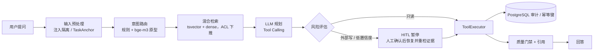

# MeetingMind

会议知识 Agent：在真实会议资料上做**带引用的问答、待办/约束抽取和受控的 Jira 写操作**。项目的重点是用冻结评测集找出缺陷并修复，每个数字都能追溯到 `backend/evaluation/reports/` 下的一份报告。



## 评测结果（基线 → 当前）

| 维度 | 数据集 | 基线 | 当前 | 报告 |
|---|---|---|---|---|
| 意图路由准确率 | 盲写一次性测试集 100 条（`route_eval_test_v4`） | 0.46（纯规则） | **0.93**（规则 + bge-m3 意图头），p95 83ms；剔除近重复后 0.93（N=84） | `route_eval_test_v4_rules_semantic_head.json` |
| 写操作人工确认召回 | 工具调用集，写操作 16 条（留出集 40 条） | 0.30（开发集，修复前） | **1.00**，未经确认的写入 0/40；同配置复跑仍为 16/16 | `tool_eval_heldout_v1_opus55.json` |
| 工具选择 / 参数准确率 | 同上，40 条 | — | 1.00 / 0.84 | 同上 |
| 约束 / 待办抽取 F1（非空 gold） | 冻结 100 条 / 28 场会议 | 0.158 / 0.139（qwen3.7-max） | **0.737 / 0.498**（Opus 5.5 + prompt v2，二者同时变更） | `meetingmind_real_v1_opus55_v2_100_scored.json`（含空 gold 的混合口径：0.467→0.833） |
| QA 引用 Precision | 同上 | 0.975 | 1.000 | 同上 |
| QA 答案忠实度（论断级，全部论断有片段依据的比例） | 同上 40 条 QA，两个评判模型盲评 | 0.65 / 0.85（qwen3.7-max） | **0.85 / 0.925**（Opus 5.5）；两评判一致判为不忠实的 1/40；注入无关句的探针 40/40 被识别 | `faithfulness_qa40_judge_{opus55,sonnet5}.json` |
| 会议内检索（已知 meeting_id，300 字块，k=5） | 40 条 QA | 发言级 Recall@5 0.073 / MRR 0.40 | 证据召回 0.293（上限 0.619）/ MRR 0.856 | `meetingmind_real_v1_chunk_retrieval.json` |
| 全库检索（不给 meeting_id，34 场会议 1626 块同池） | 40 条 QA 中 20 条针对具体议题的问题 | 会议内检索证据召回 0.461 | 找对会议 19/20（加重排 20/20），证据召回 0.333（加重排 0.379）；另 20 条"这场会议讲了什么"在全库下无法定位会议，单列 | `meetingmind_real_v1_corpus_retrieval.json` |
| 回归测试 | pytest 核心套件 | 120 | 243 passed | `scripts/run_core_tests.sh` |

**本地部署压测**（`scripts/bench_vllm_serving.py`，报告 `vllm_bench_qwen3_1p7b.json`）：vLLM 0.10 + Qwen3-1.7B fp16，单张 RTX 4060 8GB，负载为 40 条真实会议 QA（约 1.6k 字上下文，输出 ≤128 token），每档 64 请求，全部成功。

| 并发 | TTFT p50 / p95 (ms) | 端到端 p95 (ms) | 输出吞吐 (tok/s) |
|---|---|---|---|
| 1 | 93 / 169 | 1125 | 46 |
| 8 | 105 / 211 | 1702 | 248 |
| 16 | 115 / 315 | 2354 | 347 |
| 32 | 609 / 906 | 3481 | 399 |

KV cache 只有 12,800 token（约 6 路 2k 请求），并发 16→32 时吞吐只多 15%，TTFT p95 却涨到约 3 倍，说明排队开始主导。所以本机适合把并发上限设在 16。1.7B 模型只能承担路由、改写这类轻任务，不能替换 Opus 规划。

**代价与取舍**
- 换 Opus 后，抽取 p95 从 3.9s 升到 7.8s，token 用量约为原来的 23 倍。规划 p95 首轮测得 70.6s，同配置复跑为 17.7s（`tool_eval_heldout_v1_opus55_rerun2.json`，写确认仍为 16/16），首轮长尾更像中转偶发慢，按 18s 左右看待。
- 把规划换成 Sonnet 5 后（40 条，并发 4），p95 16s，与 Opus 复跑的 17.7s 基本持平，写操作确认召回却掉到 0.375（16 条写请求中 10 条没发起写操作：3 条建单给出空计划，7 条改单只调了查询），**所以没有采用**，见优化记录。
- 本地 1.7B 复杂度分类器的准确率不比规则高，p95 却有 1.35s，所以默认关闭。
- 引用不是由 LLM-as-judge 判定，而是与人工 gold 的证据 ID 做匹配。

## 一条命令复现

```bash
cd backend
bash scripts/run_core_tests.sh -q          # 243 项回归测试，无需外部服务（可用 PYTHON_BIN 指定解释器）
python scripts/check_gates.py              # 汇总 reports/，检查 19 项门禁

# 路由评测（需要本地 bge-m3）
python scripts/run_route_eval.py --semantic \
  --dataset evaluation/datasets/route_eval_test_v4.jsonl

# 以下需要 Anthropic 兼容 API：LLM_PROVIDER=anthropic LLM_API_BASE=... LLM_API_KEY=...
python scripts/run_tool_eval.py --dataset evaluation/datasets/tool_eval_heldout_v1.jsonl
EVAL_PROMPT_VERSION=v2 python scripts/run_cloud_eval_canary.py --count 100 \
  --max-tokens 768 --total-token-budget 1500000 --per-record-token-budget 8000 \
  --proxy-overhead-tokens 7000 \
  --output evaluation/reports/meetingmind_real_v1_opus55_v2_100.json
python scripts/score_cloud_eval.py \
  --run "$PWD/evaluation/reports/meetingmind_real_v1_opus55_v2_100.json" \
  --output evaluation/reports/meetingmind_real_v1_opus55_v2_100_scored.json
```

评测纪律：留出集由独立 agent 盲写，写的时候看不到代码、原型和已有报告；跑之前冻结代码并记录哈希（`reports/*_freeze.json`）；prompt 只在不含评测单元的开发/验证集上选型。


## 唯一正式主链

```text
会议文档 / WAV 音频
→ 文档解析，或 RabbitMQ + FunASR 转写
→ 说话人感知分块
→ PostgreSQL 权威正文/VectorChunk + 轻量 Dense 检索（可选 pgvector 或 Milvus）
→ PostgreSQL 关键词召回 + Dense 召回
→ 0.3 / 0.7 加权融合 + BGE Reranker
→ RAG 回答与引用
→ LangGraph 确定性业务节点或 Tool Agent
→ 参数 Schema → ToolPolicy → HITL → ToolExecutor → PostgreSQL 审计
```

## 保留能力与真实性边界

| 能力 | 当前实现 | 仍需补齐 |
|---|---|---|
| RAG | PostgreSQL 权威块、关键词召回、轻量 Dense/可选 pgvector 或 Milvus、加权融合、Reranker、引用、ACL、降级字段 | 真实评测已完成会议内与全库两轮（离线脚本，未走服务 API）；外部向量索引增量同步和生产容量仍未验收 |
| Agent | 静态 LangGraph；路由、检索、纪要/待办/争议、计划执行、风险确认、质量门禁、结构修复 | 真实业务数据上的路由与端到端效果 |
| 工具调用 | 会议/文档工具；Jira Cloud REST v3；Schema、策略、HITL、幂等和审计 | Jira 站点凭据与真实项目写入演示 |
| 异步任务 | RabbitMQ confirm、manual ACK、延迟重试、DLQ、幂等任务状态 | 多节点高可用与真实容量验收 |
| ASR | 严格 WAV 准入；独立 FunASR Worker；原始/安全证据分区、逐段注入隔离、版本化修订、状态机和 RAG 证据入库 | 脱敏多人会议真值和 CER/DER |
| LoRA/QLoRA | Qwen3-0.6B 待办抽取教学实验和统一评测 | 真实会议标注集；当前合成结果不可外推 |
| 评估 | 冻结 28 场会议/100 条任务，完成候选规范化、检索基线、云端结构化输出和抽样端到端对比 | 全库检索为离线复现同一融合策略；生成对比为每种方案 10 条抽样，不能宣称 Reranker 整体领先 |
| Trace | 有界进程内节点 Trace，只记录真实节点、耗时、重试、输出和错误 | 跨进程持久化不在当前范围 |
| 部署 | 本机 Conda 前后端/Worker、宿主机 PostgreSQL、Docker Redis/RabbitMQ/Milvus、可选镜像发布和 CI | TLS、备份、Secret Manager、HA、生产容量 |

## 技术栈

| 层 | 选型 |
|---|---|
| API / Schema | FastAPI、Pydantic、JSON Schema |
| Agent | LangGraph、自定义状态、Tool Calling、HITL |
| 检索 | PostgreSQL tsvector/VectorChunk/轻量余弦、可选 pgvector 或 Milvus、BGE-M3、BGE-Reranker |
| 数据与状态 | PostgreSQL、Redis |
| 异步任务 | RabbitMQ、aio-pika、Worker |
| ASR | FunASR（独立可选环境） |
| 微调 | Transformers、PEFT、bitsandbytes（独立实验环境） |
| 前端 | Vue 3、Vite、Element Plus、Pinia |

## API 边界

生产环境注册：

- `/api/v1/users`：注册、登录、当前用户；
- `/api/v1/meetings`、`/documents`、`/todos`：会议知识业务；
- `/api/v1/rag`：带 ACL 与引用的 RAG；
- `/api/v1/agents`：查询、SSE、批量和 HITL；
- `/api/v1/feedback`：反馈与 Bad Case；
- `/api/v1/tasks`：异步任务状态。

`/api/v1/trace` 只在 development/test 注册。完整字段见 [API 文档](docs/api.md)。

## 本地开发

后端统一使用 Conda：

```bash
cd backend
conda activate meetingmind-gpu
pip install -r requirements-core.txt
cp .env.example .env
uvicorn app.main:app --reload --host 0.0.0.0 --port 8000
```

前端使用同一套 Conda 管理口径中的 Node/npm（不作为默认 Docker 服务启动）：

```bash
conda activate meetingmind-gpu
cd frontend
npm install
npm run dev
```

本地模型、ASR 和微调分别使用 `requirements-asr.txt`、`requirements-finetuning.txt`；重型模型依赖不安装进轻量 Web/Worker 镜像。

## Compose 启动

当前统一口径是：PostgreSQL 安装在宿主机；Redis、RabbitMQ 和 Milvus 使用 Docker；后端、Worker 和前端在本机 Conda 环境运行。根目录 `.env` 服务 Docker Compose，`backend/.env` 服务本机 Conda 后端。

```bash
cp .env.example .env
python scripts/preflight_deploy.py --mode development
docker compose up -d redis rabbitmq
```

然后分别启动后端、Worker 和前端：

```bash
conda activate meetingmind-gpu
cd backend
uvicorn app.main:app --reload --host 0.0.0.0 --port 8000
```

```bash
conda activate meetingmind-gpu
cd backend
python -m app.workers.run
```

```bash
conda activate meetingmind-gpu
cd frontend
npm install
npm run dev
```

后端启动后检查：

```bash
curl --fail http://127.0.0.1:8000/health
```

Milvus 沿用本机已有的独立 Docker 容器。Compose 中的后端、Worker 和前端被放入可选的 `container-app` Profile，不属于当前默认运行口径。长期记忆的 PG 主库和 outbox 已实现，但 Milvus 记忆投影器尚未注入，`MEMORY_INDEX_WORKER_ENABLED` 必须保持关闭。

## 测试与评估

零外部依赖的主链契约：

```bash
cd backend
python -m unittest \
  tests.contracts.test_stage0_boundaries \
  tests.contracts.test_rag_mainline_contract -v
```

完整契约测试：

```bash
cd backend
pytest tests/contracts -q
```

Compose 启动后，先运行当前固定五分钟演示（HTTP 正常/权限拒绝、工具确认、队列恢复）：

```bash
python scripts/demo_five_minute.py --base-url http://127.0.0.1:8000
```

前端：

```bash
cd frontend
npm test -- --run
npm run build
```

统一离线评估：

```bash
cd backend
python scripts/evaluate.py --allow-synthetic \
  --dataset evaluation/datasets/sample_eval.jsonl \
  --output evaluation/reports/sample_report.json
```

冻结 Prompt Injection 合成回归：

```bash
cd backend
python scripts/evaluate.py --allow-synthetic \
  --dataset evaluation/datasets/prompt_injection_synthetic_v1.jsonl \
  --thresholds evaluation/prompt_injection_synthetic_thresholds.json \
  --enforce-thresholds \
  --output evaluation/reports/prompt_injection_synthetic_v1.json
```

仓库样例标记为 `synthetic`，只能验证公式、规则和控制流回归。Prompt Injection 报告中的零误报/零漏报只对当前 25 条合成样本成立；简历和 README 中的生产效果数字必须来自冻结的真实或公开人工标注数据。

## 文档与证据

公开文档只保留当前架构、运行方式、评测结果和证据边界。完整入口见 [docs/README.md](docs/README.md)。

- [项目总览](docs/项目总览.md)
- [输入预处理层技术说明](docs/架构解析/输入预处理层.md)
- [记忆层技术说明](docs/架构解析/记忆层.md)
- [规划推理层技术说明](docs/架构解析/规划推理层.md)
- [真实会议评测收口](docs/真实会议评测收口.md)
- [证据与限制](docs/证据与限制.md)
- [固定五分钟演示](docs/固定五分钟演示.md)
