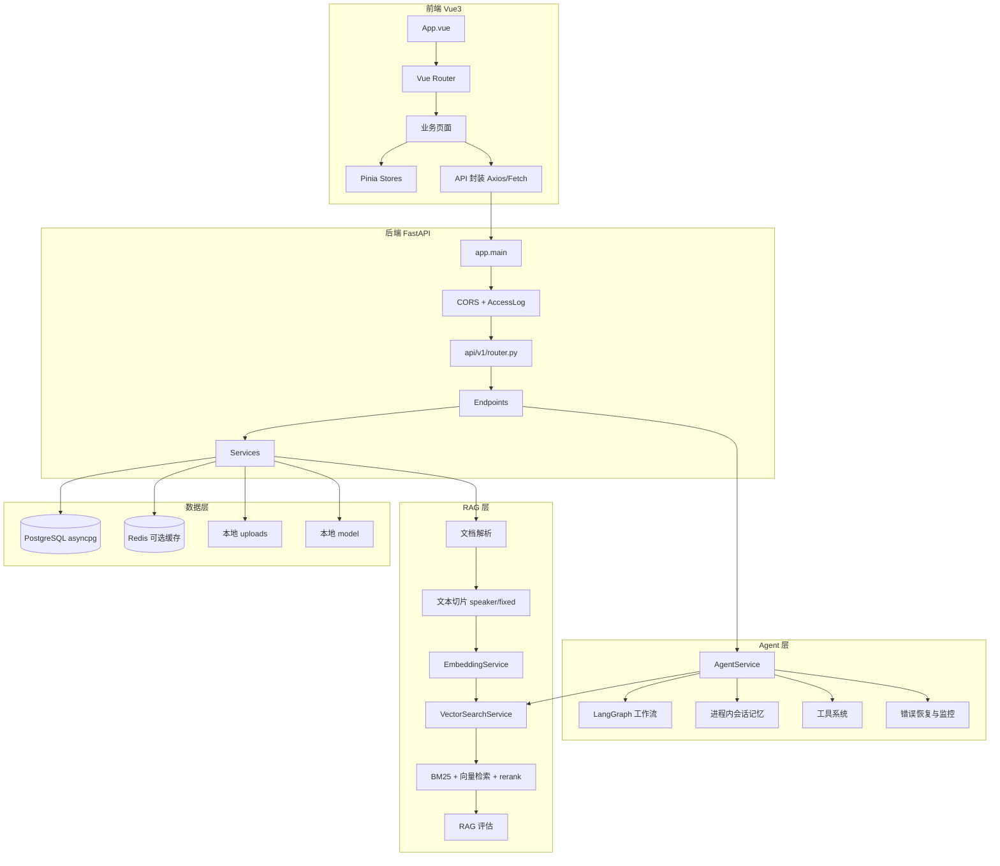
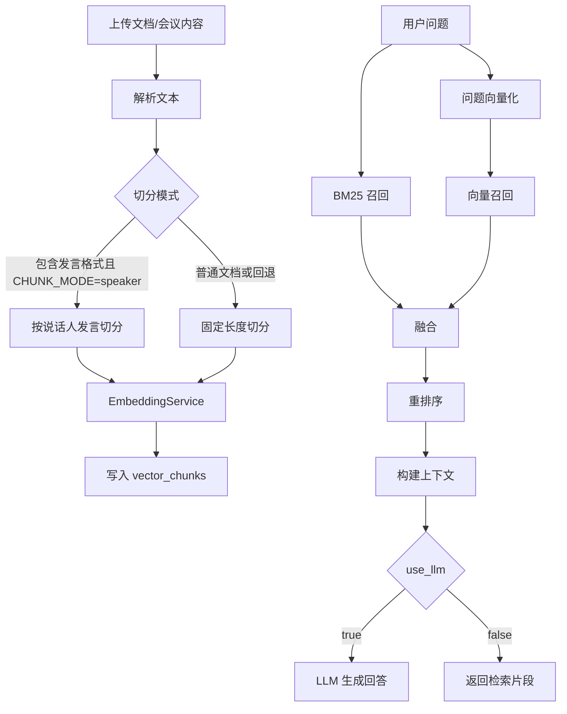
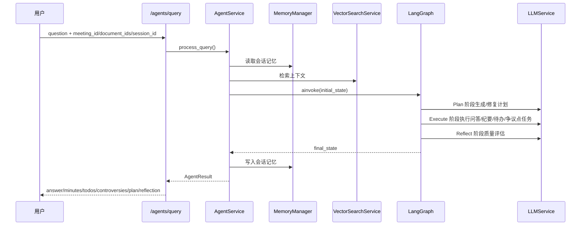
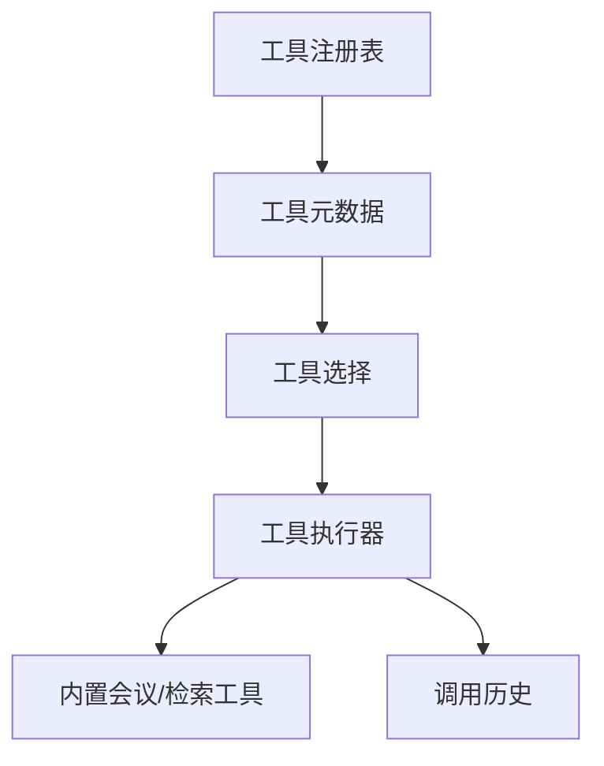
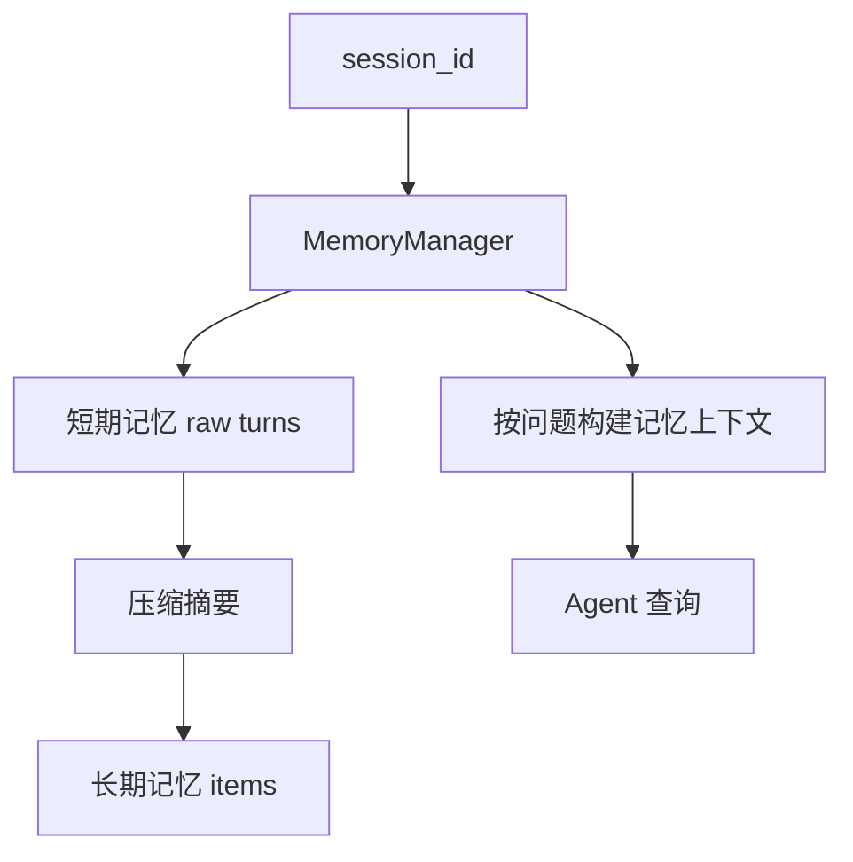

# MeetingMind 系统架构文档

本文档描述当前代码中的实际架构。部署、限流、对象存储、任务队列和集中式监控等能力未在当前仓库中完整落地，因此只作为后续扩展方向，不作为现状描述。

---

## 1. 系统概览

MeetingMind 是一个基于 FastAPI + Vue3 的会议智能助手系统，核心能力包括会议/文档/待办 CRUD、文本处理、向量化、RAG 问答、RAG 评估和 Agent 任务执行。



---

## 2. 后端模块结构

```text
backend/app/
├── main.py                 # FastAPI 入口，中间件、异常处理、路由挂载
├── api/v1/
│   ├── router.py           # 路由聚合
│   └── endpoints/          # users/meetings/documents/todos/rag/agents 等接口
├── agents/                 # LangGraph Agent、记忆、工具、Prompt、监控
├── core/                   # 配置、安全、响应、缓存、日志、异常、中间件
├── db/                     # SQLAlchemy async engine 与会话
├── models/                 # ORM 模型
├── schemas/                # Pydantic 请求/响应模型
├── services/               # RAG、向量化、文档、会议、待办、LLM 等服务
└── utils/                  # 缓存工具等通用工具
```

后端启动时执行：

1. 创建 FastAPI 应用。
2. 注册 CORS、访问日志中间件和异常处理器。
3. 调用 `init_db()` 自动建表。
4. 初始化 Redis 连接；配置关闭或连接失败时降级。
5. 挂载 `/api/v1` 路由。

---

## 3. 前端模块结构

```text
frontend/src/
├── main.js
├── App.vue
├── router/index.js
├── api/                    # Axios 请求封装，Agent 流式接口使用 Fetch
├── stores/                 # Pinia 状态
├── components/layout/      # 应用布局
└── views/                  # 登录、会议、文档、待办、RAG、Agent、配置、评估页面
```

前端通过 Vite proxy 将 `/api` 转发到后端 `http://localhost:8000`。

---

## 4. 数据模型

当前核心表：

| 表 | 说明 |
|----|------|
| `users` | 用户账号、邮箱、部门、角色、密码哈希 |
| `meetings` | 会议主表，保存标题、参会人、原文、摘要、纪要等 |
| `speech_records` | 会议发言记录 |
| `documents` | 上传文档元数据和解析文本 |
| `todo_items` | 待办事项 |
| `vector_chunks` | 文档/会议切片及向量 |
| `configs` | 配置中心持久化表 |

`vector_chunks` 同时保留 JSON 文本向量和 PostgreSQL ARRAY 字段。检索服务会检测环境能力，在 `pgvector` 和轻量模式之间选择。

---

## 5. RAG 流程



相关配置：

| 配置 | 默认值 | 说明 |
|------|--------|------|
| `CHUNK_MODE` | `speaker` | 优先按说话人切分 |
| `CHUNK_SIZE` | `512` | 固定切片大小 |
| `CHUNK_OVERLAP` | `64` | 固定切片重叠 |
| `TOP_K_DEFAULT` | `5` | 默认检索数量 |
| `SIMILARITY_THRESHOLD` | `0.7` | 相似度阈值 |
| `ENABLE_MULTI_RETRIEVAL` | `true` | 多路召回 |
| `ENABLE_BM25` | `true` | BM25 |
| `ENABLE_RERANK` | `true` | 重排序 |

---

## 6. Agent 工作流



Agent 当前能力：

- Plan-Execute-Reflect 工作流。
- 可选 Tool Calling 图。
- 会话级短期/长期记忆，当前主要为进程内状态。
- Prompt 模板、任务模板、计划验证、计划自动修复。
- 错误恢复与监控。
- 人机确认接口。
- SSE 流式输出 `start`、`phase`、`thought`、`context`、`final` 等事件。

---

## 7. 工具调用系统



工具相关代码位于 `backend/app/agents/tools/`。当前工具系统服务于 Agent Tool Calling 模式，包含工具注册、选择、执行、历史记录和自定义工具管理。

---

## 8. 记忆系统



当前记忆存储在 `AgentService.session_memories` 中。服务重启后会丢失；如果需要生产可用，应改为数据库或 Redis 持久化，并按用户和会话隔离。

---

## 9. 配置与缓存

配置来源：

- `backend/app/core/config.py` 中的默认值。
- `backend/.env` 覆盖默认值。
- 配置中心接口可管理运行期配置项。

Redis 通过 `CACHE_ENABLED` 和 `REDIS_URL` 控制。当前 Redis 主要作为可选缓存能力，不是所有模块的强依赖。

---

## 10. 测试与评估

当前测试：

- 后端单元测试位于 `backend/tests/unit`。
- 前端 Vitest 测试位于 `frontend/src/tests`。
- RAG 评估数据集位于 `backend/tests/rag_eval_dataset.py`。

评估能力：

- `GET /api/v1/evaluation/dataset`
- `POST /api/v1/evaluation/evaluate`
- `POST /api/v1/evaluation/evaluate/{question_id}`
- `POST /api/v1/evaluation/evaluate-all`

---

## 11. 当前技术栈

| 层级 | 技术 | 说明 |
|------|------|------|
| 前端 | Vue3 + Vite + Element Plus | 页面与组件 |
| 状态 | Pinia | 登录态和业务状态 |
| HTTP | Axios + Fetch | 普通请求和 SSE 流式请求 |
| 后端 | FastAPI + Uvicorn | 异步 API |
| ORM | SQLAlchemy 2 async | 数据访问 |
| 数据库 | PostgreSQL asyncpg | 默认数据库 |
| 缓存 | Redis | 可选缓存 |
| 向量化 | sentence-transformers / BGE-M3 | 文本向量 |
| 检索 | BM25 + 向量检索 + rerank | 多路召回 |
| LLM | OpenAI 兼容接口，默认 DashScope/Qwen | 问答、规划、反思 |
| Agent | LangGraph | 任务流编排 |
| 测试 | pytest + Vitest | 后端/前端测试 |

---

## 12. 后续架构优化方向

- 将 Agent 记忆、确认请求和协作消息从进程内状态迁移到数据库或 Redis。
- 为 Agent SSE 协议定义稳定 schema，并补充端到端测试。
- 增加真实权限策略和管理端校验，避免配置/评估接口裸露。
- 将文档解析、向量化、评估等耗时任务异步化。
- 对向量索引、模型加载和多路召回增加可观测性指标。
