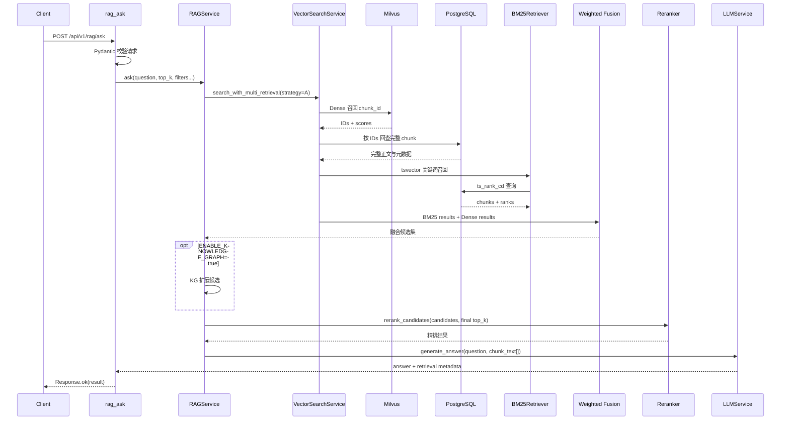

# RAG 主链路走读与契约基线

> **历史快照**：本文保留阶段 0 当时的走读过程、问题和测试基线。其中“仍未完成”和旧 README/Sparse/RRF 描述不是当前状态；阶段 1 与阶段 7 已完成主链收敛。

> 日期：2026-08-24
> 对应路线：阶段 0「确定唯一 RAG 主链路、建立核心测试清单」
> 学习目标：能够脱离 README，按代码解释一次 RAG 请求如何流动、每层交换什么数据、哪里降级，以及当前还不能宣称什么。

## 1. 本轮结论

`POST /api/v1/rag/ask` 的唯一正式检索策略冻结为方案 A：

```text
单一原始问题
→ Dense 召回（Milvus ID 召回 + PostgreSQL 正文回查，失败时 PG 回退）
→ PostgreSQL tsvector 关键词召回
→ 0.3 × 关键词分数 + 0.7 × Dense 分数的加权融合
→ 可选 KG 候选扩展（默认关闭）
→ BGE Reranker 精排
→ LLM 基于正文生成答案
```

当前正式链路明确不包含：

- Sparse/BGE-M3 lexical vector；
- RRF；
- Query Rewrite、HyDE、Multi-Query、Step-back；
- 策略 B 或策略 M；
- 默认知识图谱增强。

这些代码可能仍存在于仓库，但“存在”不等于“进入正式请求路径”。`RAGService` 在调用检索服务时显式传入 `strategy="A"`，这是当前主链路的代码级边界。

## 2. 从 HTTP 到答案的真实调用链



需要特别注意：图中的 Dense 和关键词召回在概念上是两路召回，但当前代码是先 Dense、再 BM25，尚未用 `asyncio.gather` 并行执行。不能在面试或 README 中把它说成“并行召回”。

### 2.1 API 层

入口位于 `backend/app/api/v1/endpoints/rag.py:24`。

请求 Schema 位于 `backend/app/schemas/text_process.py:62`，主要字段是：

| 字段 | 类型 | 作用 |
|---|---|---|
| `question` | `str` | 用户问题，至少 1 个字符 |
| `top_k` | `int?` | 最终期望结果数，范围 1～50 |
| `meeting_id` | `int?` | 会议过滤 |
| `department` | `str?` | 部门过滤 |
| `similarity_threshold` | `float?` | Dense 相似度阈值，范围 0～1 |
| `use_llm` | `bool` | 是否生成答案；关闭时直接返回检索文本 |

API 层先检查 pgvector 和 Milvus 能力，再构造 `RAGService`。显式传入 `0.0` 相似度阈值时必须保留该值，不能用 Python 的 `or` 将它错误替换成默认值，本轮已修正。

### 2.2 RAG 编排层

核心入口位于 `backend/app/services/rag_service.py:40`。

这一层不负责实现向量算法，而负责确定阶段顺序和失败边界：

1. 将最终 `top_k` 与 `RERANK_TOP_N` 分开，默认先获取至少 10 个候选；
2. 调用唯一检索方法 `search_with_multi_retrieval`；
3. 可选执行 KG 扩展；
4. 将候选精排为用户要求的 `top_k`；
5. 提取 `chunk_text` 给 LLM；
6. 无召回结果或 LLM 失败时返回稳定降级结果。

这里要掌握一个关键关系：

```text
召回候选数 >= Reranker 输入数 >= 最终 top_k
```

Reranker 是精度优化器，不是召回器。如果正确答案在召回阶段已经被截掉，Reranker 无法把它重新找回来。本轮修复前，RAG 会先把融合结果截成最终 `top_k` 再精排，精排只能改变顺序，不能从更大的候选池中择优。

### 2.3 Dense 召回层

入口位于 `backend/app/services/vector_search_service.py:111`。

Milvus 可用时：

1. 先查 Redis 精确缓存；
2. 从 Milvus 召回 `chunk_id + score`；
3. 使用这些 ID 回 PostgreSQL 读取完整正文；
4. 应用相似度阈值并截取结果；
5. 写入缓存。

Milvus 无结果或执行异常时，回退到 pgvector；pgvector 不可用时，再回退到 Python 余弦相似度计算。

这个设计中 PostgreSQL 是正文事实源，Milvus 是召回索引。Milvus 命中不能直接作为最终正文，必须回 PostgreSQL 做存活和内容一致性校验。

当前降级策略的优点是可用性较高，代价是宽泛的 `except Exception` 可能把代码缺陷也伪装成“Milvus 不可用”。因此必须同时有契约测试和分阶段指标，不能只依赖自动回退。

### 2.4 关键词召回层

入口位于 `backend/app/services/bm25_retriever.py:24`。

代码实际使用 PostgreSQL `tsvector + plainto_tsquery + ts_rank_cd`。项目中称它为 BM25，是工程上的“BM25 风格关键词检索”简称，并不是从公式层面严格实现 Okapi BM25。

关键词召回擅长：

- 人名、项目代号、错误码等精确词；
- 查询与文档有明显词面重合的场景；
- 不依赖向量模型即可解释匹配原因。

本轮将 BM25 结果从 200 字展示片段改为完整 `chunk_text`。原因是该结果还要进入融合、Reranker 和 LLM；检索层提前截断会丢失正文，展示截断应由 API 或 UI 单独完成。

### 2.5 加权融合层

方案 A 位于 `backend/app/services/enhanced_retrieval_fusion.py:430`。

它先分别用每一路的最大分数做归一化：

```text
normalized_score = raw_score / max_score_of_this_retriever
```

再按 `chunk_id` 去重并计算：

```text
fusion_score = 0.3 × normalized_bm25 + 0.7 × normalized_dense
```

如果某个 chunk 只被一路召回，另一项按 0 处理。两路都命中同一 chunk 时，`sources` 记录为 `['bm25', 'dense']`。

归一化是必要的，因为关键词 rank 与余弦相似度不在同一个量纲。但“各自除以最大值”也有局限：每次查询的分数分布不同，跨查询不能直接比较融合分数，权重 0.3/0.7 也必须通过离线评测验证，不能凭直觉宣称最优。

本轮额外冻结了正文优先级：Dense 结果已经过 PostgreSQL 正文回查，因此两路命中同一 chunk 时优先保留 Dense 的完整正文，不能让关键词展示片段覆盖它。

### 2.6 Reranker 层

入口位于 `backend/app/services/reranker.py:90`，异步入口位于 `backend/app/services/reranker.py:136`。

BGE Reranker 以 `query + candidate content` 为一对进行交叉编码，比独立编码后做向量相似度更擅长精排，但计算成本更高，所以只应用在较小候选池上。

模型不可用时，代码回退到词重叠和关键词位置评分。同步模型推理通过线程池执行，避免直接阻塞 FastAPI 事件循环。

### 2.7 生成层

入口位于 `backend/app/services/llm_service.py:137`。

LLM 接收的是按精排顺序排列的 `chunk_text[]`。上下文总长度受 `LLM_MAX_CONTEXT_CHARS=5000` 限制，超出后按当前顺序截断。生成失败时，RAGService 不返回空响应，而是把前三条检索正文作为降级答案。

这说明检索排序会影响两次结果：先决定哪些 chunk 进入前排，再决定 5000 字预算先分给谁。

## 3. 数据契约

正式检索结果至少应满足：

```python
{
    "chunk_id": 7,                 # 跨召回器去重主键
    "document_id": 2,              # 来源文档
    "chunk_text": "完整正文",      # Reranker 与 LLM 的输入
    "score": 0.91,                 # 当前阶段的排序分数
    "sources": ["bm25", "dense"], # 命中的召回通道
}
```

可选元数据包括 `meeting_id`、`department`、`speaker_name`、`time_offset` 和 `metadata_json`。

字段职责必须稳定：

- `chunk_id` 用于跨召回器去重，不能用 `document_id` 替代，否则一个文档的多个 chunk 会被错误合并；
- `chunk_text` 必须是完整正文，不是 UI 摘要；
- `score` 只表示当前排序阶段的分数，不能把 Dense、融合和 Rerank 分数混为一个指标；
- `sources` 用于解释召回来源，不代表引用证据已经完整实现。

RAGService 成功结果包含 `answer`、`chunks`、`count`、`mode`、`retrieval_strategy` 和 `retrieval_sources`。`mode` 现固定为字符串 `milvus`、`pgvector` 或 `lightweight`，空结果时也不再返回布尔值。

## 4. 本轮从代码中发现并修复的问题

| 问题 | 直接影响 | 修复与证明 |
|---|---|---|
| RAG 调用 `multi_retrieval_search`，实际服务只提供 `search_with_multi_retrieval` | `/rag/ask` 在召回前触发 `AttributeError` | 统一方法名；契约测试只提供正式方法仍能完成请求 |
| Dense 成功后调用不存在的 `set_cache_result` | 成功路径抛异常并被伪装成 Milvus 回退 | 改为 `set_cached_result`；测试断言缓存写入且不触发回退 |
| BM25 只返回最多 200 字 | Reranker 和 LLM 丢失正文 | 返回完整 `chunk_text`；长文本契约测试覆盖 |
| 融合时 BM25 片段可能覆盖 Dense 正文 | 两路都命中时反而损失内容 | 明确 Dense/PG 完整正文优先级 |
| KG 关闭时仍无条件初始化并分析查询 | 可选功能成为隐式必需依赖 | KG 初始化移入开关内部，默认关闭 |
| 精排前已经截成最终 `top_k` | Reranker 只能换序，不能从更大候选池择优 | 默认召回至少 `RERANK_TOP_N=10`，再精排到最终 `top_k` |
| 空结果的 `mode` 可能是布尔值 | 同一字段成功/失败类型不一致 | 统一为三种字符串模式 |
| `similarity_threshold=0.0` 被 `or` 替换 | 合法请求值失效 | API 层改为显式判断 `None` |

## 5. 仍然存在的边界与风险

这些内容本轮只做事实标记，不把“计划”写成“已实现”：

1. **RAG HTTP 入口尚未接通文档 ACL。** Endpoint 没有当前用户依赖，`RAGService.ask` 和 `search_with_multi_retrieval` 也没有 `AccessContext` 参数。
2. **缓存尚未纳入权限上下文。** 即使下一步把 ACL 传到底层，缓存键也必须包含权限作用域，或在受保护查询中禁用共享缓存，否则可能跨用户复用召回结果。
3. **两路召回仍为顺序 I/O。** 可以并行化，但要先确认数据库连接、模型调用和异常隔离策略。
4. **相似度阈值只直接约束 Dense。** 它不是融合后统一阈值，API 字段说明后续应更准确。
5. **缺少可复现的真实服务集成基线。** 当前机器的 base Python 没有安装 FastAPI、SQLAlchemy 和 pytest，Docker 服务也未运行；本轮只能运行零外部依赖的契约测试和语法检查。
6. **没有引用 Schema。** 返回了 chunks 和来源通道，但尚未形成答案句子到 `document_id/chunk_id/time_offset` 的可核验引用。
7. **README 仍包含三路召回、Sparse、RRF 和未经本轮复现的指标。** 它仍是阶段 0 的下一项清理任务，不能作为当前能力证据。
8. **Agent 检索路径仍受 Query Rewrite 和本地配置影响。** 本文只冻结 `/rag/ask`；Agent 主链路需要单独走读并关闭未经评测的默认增强。

## 6. 最小契约测试基线

测试文件：`backend/tests/contracts/test_rag_mainline_contract.py`

运行命令：

```bash
cd /home/lenovo/A/meetingmind-agent/backend
python3 -m unittest -v tests.contracts.test_rag_mainline_contract
```

2026-08-24 基线：

```text
Ran 6 tests in 0.089s
OK
```

六条测试分别证明：

1. RAG 只调用唯一正式检索方法，并正确传递过滤参数；
2. 空召回时返回稳定结构和字符串模式；
3. Reranker 能拿到大于最终 `top_k` 的候选池；
4. 两路命中同一 chunk 时保留完整正文；
5. BM25 不在检索层截断正文；
6. Milvus 成功路径正确写缓存，不误走降级。

这是一套“接口契约基线”，不是效果评测，也不是外部服务集成测试。它回答的是“层与层能否正确协作”，还不能回答“检索是否足够准、延迟是多少”。

## 7. 你应该真正掌握的四个问题

### 7.1 为什么既要关键词召回又要 Dense？

关键词检索擅长精确词面匹配，Dense 擅长语义相似和改写表达。两者的错误模式不同，融合的价值是提高召回覆盖，而不是简单堆叠模型。

### 7.2 Fusion 和 Rerank 有什么区别？

Fusion 合并多路候选和分数，解决“多个召回器如何形成一个候选列表”；Rerank 对较小候选集做更精细的 query-document 相关性判断，解决“候选如何重新排序”。

### 7.3 为什么 Milvus 命中后还要查 PostgreSQL？

向量库负责快速找到近邻，PostgreSQL 才是正文、软删除状态和权限的事实源。索引可能延迟或残留，因此不能把向量库结果直接当作最终可见数据。

### 7.4 为什么测试要隔离外部服务？

契约错误与数据库是否启动无关。用替身隔离 PostgreSQL、Milvus、Redis 和模型后，可以快速证明方法名、参数、字段和降级结构没有破坏；之后再用集成测试证明真实基础设施协作。

## 8. 自测与动手实验

先自己作答或预测，再查看代码和运行测试。

### 自测 1：召回场景

下面两个查询更可能由哪一路先命中？为什么？

1. `ERR_CONN_042 是谁在会上提出的？`
2. `大家最后决定什么时候发布产品？`，而原文写的是“上线时间定在周五”。

预期思路：第一个更依赖精确词面的关键词召回；第二个更依赖 Dense 的语义匹配。实际结果仍需数据集验证。

### 自测 2：手算融合分数

假设 BM25 最大原始分数为 10，Dense 最大相似度为 0.8：

```text
chunk A: BM25=8, Dense=0.6
chunk B: BM25=10, Dense=0.4
```

按 0.3/0.7 权重计算：

```text
A = 0.3 × (8/10)  + 0.7 × (0.6/0.8) = 0.765
B = 0.3 × (10/10) + 0.7 × (0.4/0.8) = 0.650
```

所以 A 排在 B 前。这个练习帮助理解“原始分数大”不等于“融合分数一定大”。

### 自测 3：解释降级

依次回答：

1. Milvus 不可用时走哪条路径？
2. Reranker 模型不可用时发生什么？
3. LLM API 失败时用户还能拿到什么？
4. 为什么宽泛异常捕获既提高可用性，又可能隐藏 bug？

### 动手实验：验证候选池作用

在契约测试中把 `RERANK_TOP_N` 从 10 改成 3，先预测 `test_reranker_receives_a_candidate_pool_larger_than_final_top_k` 是否还能表达“先召回、后精排”的价值，再运行测试观察。实验后恢复为 10，不提交这个临时改动。

## 9. 掌握标准与下一步

当你能不看文档完成以下任务，就算掌握了本轮内容：

- 在 3 分钟内画出 `/rag/ask` 的真实链路；
- 说清 BM25-style、Dense、Fusion、Reranker 各自解决什么问题；
- 根据一个结果字典判断 `chunk_id/chunk_text/score/sources` 的职责；
- 解释本轮任意一个契约 bug 为什么会触发，以及哪条测试能防止回归；
- 明确指出当前 ACL、引用、真实指标尚未完成，不把它们包装成已有能力。

建议下一步仍留在阶段 0：以本文冻结的主链路为依据，清理 README 中 Sparse/RRF、三路召回和未复现指标等过期描述；随后再走读 Agent 唯一主链路及 Query Rewrite 默认开关。
