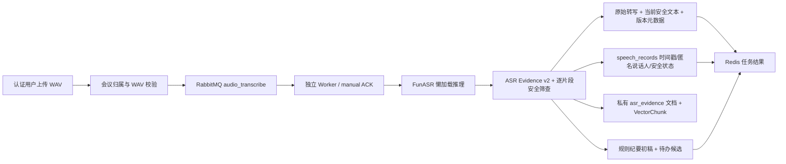

# 阶段 4：真实 ASR 与音频证据闭环

> **阶段证据说明**：公开 WAV 的真实推理和队列烟测仍是有效证据；文中模型版本与硬件数字只对 2026-08-26 的该次运行负责。
>
> **2026-08-27 输入层续改**：真实推理指标不变；当前持久化契约已升级为 ASR Evidence v2，增加严格 MIME 准入、独立转写状态、原始/安全文本分区、逐片段注入隔离、人工修订版本和 RAG 索引生命周期。

## 1. 本阶段结论

阶段 4 已接入一种真实 ASR：本地 `FunASR 1.4.3`，默认配置为 `paraformer-zh + fsmn-vad + ct-punc + CAM++`。正式入口只接受 WAV，并通过 RabbitMQ 异步处理。转写结果会持久化到会议正文、发言记录和版本化元数据中；旧 OpenAI Whisper、视频和 Qwen-VL 路径已在阶段 7 删除，不是“默认关闭”的可选能力。

本机已完成两类无 mock 验证：

- 官方公开 AISHELL 单句样例的真实 GPU 推理与 CER/WER 计算；
- PostgreSQL + Redis + RabbitMQ + FunASR 的完整队列烟测。

但尚无脱敏多人会议真值集，因此不能宣称已经得到会议领域 ASR 准确率或说话人分离准确率。

## 2. 正式链路



入口是 `POST /api/v1/tasks/audio`，表单字段为 `meeting_id` 和 `file`，支持 `Idempotency-Key`。状态继续使用阶段 3 的 `/api/v1/tasks/{task_id}` 与等待接口。

## 3. 为什么先只支持 WAV

当前机器没有 ffmpeg。若接口接受 MP3/M4A 却依赖机器上偶然存在的解码器，会形成不可复现的“支持”。因此正式入口只接受能由 Python 标准库校验的 WAV：

- 检查扩展名、MIME、RIFF/WAV 结构、帧数、采样率、声道、大小和时长；
- 服务端生成存储名，不信任客户端文件名；
- 路径限定在 `UPLOAD_DIR/audio/<user_id>`；
- 成功后按配置删除原始上传，数据库保留音频 SHA-256 和证据元数据。

以后若引入 ffmpeg，应把转码器版本、目标采样率、声道策略和失败类型一并写入 Schema，再扩展格式列表。

## 4. 模型生命周期与并发

FunASR/PyTorch 是可选重型依赖，普通 Web/Worker 启动不会导入它们。音频消费者首次收到任务时才初始化模型，并在同一进程内复用。单个模型句柄用锁串行推理，RabbitMQ prefetch 决定每个 Worker 的在途任务数；横向扩展应增加独立 ASR Worker，而不是让一个 GPU 模型对象被无界并发调用。

可选依赖在 `backend/requirements-asr.txt`，模型缓存不进入 Git。推荐建立独立环境：

```bash
cd backend
python -m venv .venv-asr
source .venv-asr/bin/activate
pip install -r requirements-core.txt
# 先按 pytorch.org 为本机 CUDA 安装 PyTorch
pip install -r requirements-asr.txt
```

官方资料：

- [FunASR README 与 AutoModel 用法](https://github.com/modelscope/FunASR)
- [AutoModel 的 VAD/PUNC/SPK 参数与推理实现](https://github.com/modelscope/FunASR/blob/main/funasr/auto/auto_model.py)
- [CAM++ 说话人和句级时间戳官方示例](https://github.com/modelscope/FunASR/blob/main/examples/industrial_data_pretraining/sense_voice/demo_spk.py)
- [公开样例及参考文本来源](https://github.com/modelscope/FunASR/blob/main/examples/industrial_data_pretraining/sense_voice/README_zh.md)

工具包采用 MIT 许可证，但模型许可证可能不同；生产使用前必须逐个复核模型卡和许可证。

## 5. 证据 Schema

当前 `meetingmind.asr-evidence.v2` 至少保存：

- provider、ASR/VAD/标点/说话人模型和 FunASR 包版本；
- 设备、音频 SHA-256、时长、采样率、声道；
- 总延迟、模型初始化时间、热推理时间与 RTF；
- 首次模型全文哈希、当前安全/修订文本哈希、句级起止时间、匿名 `speaker_N`；
- 时间戳来源、说话人信息是否可用和不确定性。
- 证据版本、pending/processing/completed/failed、人工复核状态和索引状态；
- 每个片段的 passed/warning/quarantined、隔离原因和内容哈希。

`speaker_N` 只是 CAM++ 聚类标签，不代表真实姓名或身份。缺少句级时间戳时会显式回退为整段音频边界并写入 `uncertainties`，不会伪造精确时间。

已有数据库升级命令：

```bash
PYTHONPATH=backend python backend/app/db/migrations/0008_add_asr_evidence_columns.py
PYTHONPATH=backend python backend/app/db/migrations/0009_harden_asr_evidence_lifecycle.py
```

已有数据库需要按编号依次执行；冷启动新库由 SQLAlchemy metadata 直接创建完整字段。原始未筛查全文不通过会议 API 暴露，Agent/RAG 只消费当前安全版本。人工修订会递增版本并让旧 PostgreSQL 向量块/缓存失效后重建；若空转写、全部隔离或重建失败，索引状态会明确标为 `not_created` 或 `rebuild_required`。

## 6. 真实公开样例结果

原始报告：

- `backend/evaluation/reports/asr_public_smoke_20260826.json`
- `backend/evaluation/reports/asr_queue_smoke_local_20260826.json`

测试环境：RTX 3060 12GB、CUDA PyTorch 2.11.0、FunASR 1.4.3。输入是官方教程引用的 4.204 秒公开 AISHELL 单句，不是会议录音。

| 指标 | 本次结果 |
|---|---:|
| 参考文本 | 甚至出现交易几乎停滞的情况 |
| 模型输出 | 甚至出现交易几乎停滞的情况。 |
| 归一化 CER | 0.000000 |
| jieba 分词 WER | 0.000000 |
| 缓存模型的进程冷启动 | 27.992 s |
| 热推理 | 0.079 s |
| 热推理 RTF | 0.0188 |
| 时间戳/匿名说话人 | 已返回 |

归一化会执行 NFKC、转小写并移除空白、标点和符号。中文 WER 使用 jieba 分词，因此报告 WER 时必须同时说明规则；本项目以 CER 为中文主指标。

零错误只适用于这一条公开短句。它证明模型、CUDA、Schema 和评测程序真实运行，不证明会议场景质量。

## 7. 队列业务烟测

真实烟测创建临时禁用用户和会议，发布 `audio_transcribe` 消息，再由消费者完成：

```text
pending → processing → completed → broker ACK
```

验证结果：任务尝试 1 次，会议正文已写入，1 条发言记录保留了起止时间与匿名说话人，元数据版本正确，纪要被明确标记为“规则抽取、需人工核验”。脚本随后删除临时用户、会议、发言和 Redis 任务；RabbitMQ 主队列、重试队列和死信队列均为空。

复现脚本：

- `backend/scripts/run_asr_evaluation.py`
- `backend/scripts/run_asr_queue_smoke.py`

## 8. 纪要和待办的真实性边界

ASR Worker 会生成抽取式摘要、规则纪要初稿和待办候选，但不会把候选直接写成正式 `todo_items`。原因是待办属于业务动作，当前规则匹配没有达到可量化质量，也没有人工确认环节。

这使闭环具备可演示的“音频 → 证据 → 纪要初稿 → 待办候选”，同时把“高质量结构化抽取”留给阶段 5 的 Prompt/Few-shot/LoRA 公平对比。任何界面必须继续显示“需人工核验”。

## 9. 测试与学习检查点

合同测试覆盖 WAV 伪装文件、受管路径、时间戳/说话人解析、证据来源、规则初稿标签、专用队列和 CER/WER 归一化。

```bash
DEBUG=false PYTHONPATH=backend backend/venv/bin/python -m pytest -q \
  backend/tests/contracts/test_asr_contract.py \
  backend/tests/contracts/test_task_queue_reliability.py
```

学习时应能回答：

1. 为什么模型必须懒加载，Web 与 ASR Worker 为什么应拆开？
2. publisher confirm、manual ACK 与任务幂等分别解决什么问题？
3. 匿名说话人聚类与身份识别有什么区别？
4. 为什么单条公开样例 CER=0 不能写成“项目准确率 100%”？
5. 冷启动、热推理、RTF 三个数字应该如何解释？
6. 为什么待办候选不直接写入正式业务表？

## 10. 尚需用户提供或决定

- 脱敏、可合法使用的多人会议 WAV 及逐字稿，才能冻结 `sample_kind=real_meeting` 数据并报告正式 CER。
- 若要评估说话人分离，还需带说话人区间真值，才能计算 DER，而不是只检查“返回了 speaker 标签”。
- 生产部署前需确认四个模型的许可证、GPU/CPU 预算和原始音频保留策略。
- MP3/M4A 支持需要把 ffmpeg 纳入镜像、版本锁定和安全测试。
