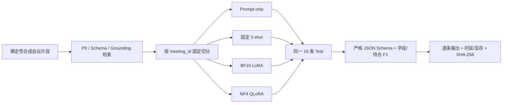

# 阶段 5：LoRA / QLoRA 可复现实验

## 1. 结论先行

阶段 5 已形成真实可运行的教学闭环：合成数据构建与校验、固定切分、Qwen3-0.6B 的 BF16 LoRA 和 NF4 QLoRA、Prompt-only / 3-shot / LoRA / QLoRA 同协议评测、逐条预测、权重哈希和单条推理 Demo。

但本阶段**没有得到真实会议效果基线**。76 条数据全部是项目自编合成文本，0 条来自真实用户，0 条经过人工复核。当前结果只能证明训练工程、对照实验和边界分析能力。

## 2. 为什么没有直接拿现有 217 份转写训练

现有转写被项目文档标注为 AliMeeting 公开语料，但工作区没有原始 meeting key 与 Action Item Detection 真值映射。官方 AliMeeting4MUG 确实提供 AID 赛道，官方代码的下载函数要求 ModelScope 个人 Token；仓库示例只有 5 个 meeting key 的伪提交文件，不构成训练集。

如果直接用规则或模型给 217 份转写贴标签，再把它写成“人工标注真实会议数据”，会同时制造数据来源和标签质量两类虚假。因此本轮选择更保守的边界：数据全部自行合成、标签生成方式机器可查、指标标题明确写“合成集”。

外部参考：

- [AliMeeting4MUG 官方任务与 AID 基线](https://github.com/alibaba-damo-academy/SpokenNLP/blob/main/alimeeting4mug/readme.md)
- [ModelScope Alimeeting4MUG 数据页](https://modelscope.cn/datasets/modelscope/Alimeeting4MUG)

## 3. 实验链路



代码入口：

- 数据与校验：`backend/finetuning/build_dataset.py`；
- 共享 Prompt、Schema 和指标：`backend/finetuning/common.py`；
- 训练：`backend/finetuning/train_adapter.py`；
- 公平评测：`backend/finetuning/evaluate.py`；
- 单条 Demo：`backend/finetuning/infer_todos.py`；
- 数据卡：`backend/finetuning/DATA_CARD.md`。

## 4. 任务与数据

任务是“从带匿名说话人与时间戳的会议片段中抽取正式待办”。输出和正式 `TodoOutput` 对齐，并额外执行严格字段集合检查。

| 切分 | 样本 | 含待办样本 | 用途 |
|---|---:|---:|---|
| Train | 48 | 36 | Adapter 参数更新、3-shot 候选来源 |
| Validation | 12 | 8 | 每轮验证 loss |
| Test | 16 | 12 | 四组统一评测；含 2 条双待办 |

负例专门覆盖“建议、疑问、已完成、已取消、暂缓、未分配”。这是待办抽取里很容易被忽略的一点：只训练正例会让模型把所有将来时或动词都当任务。

每条样本一个独立 `meeting_id`，因此没有会议级泄漏；但语言模板在切分间共享，仍会高估泛化。数据 manifest 的当前 SHA-256 为 `1e140233a3dbbdb18357ba43b3128452d4013e6887e473ff9aaa15bbbb62f360`。

## 5. 模型与公平控制

基座是本地 [Qwen3-0.6B 官方模型](https://huggingface.co/Qwen/Qwen3-0.6B)，许可证为 Apache-2.0。选择 0.6B 的原因不是追求最高质量，而是让 12GB 消费级 GPU 能在数十秒内完整复现实验。

| 控制项 | 四组共同设置 |
|---|---|
| 基座 | 同一份 Qwen3-0.6B 权重及 SHA-256 |
| Test | 同一 16 条、同一顺序 |
| System Prompt | 同一字段和拒绝猜测规则 |
| 生成 | `enable_thinking=false`、`do_sample=false`、最多 240 tokens |
| 校验 | 同一严格字段集合、类型和枚举 |
| 指标 | JSON/Schema 合法率、严格匹配、字段 F1、待办项 F1、被接受输出的幻觉字段率 |

3-shot 固定使用一条负例、一条缺期限正例和一条完整正例。LoRA 与 QLoRA 使用相同 48 条训练集、5 轮、batch size 2、梯度累积 4、学习率 2e-4、rank 8、alpha 16、dropout 0.05，并按 PEFT 的 QLoRA 做法把目标设为 `all-linear`。QLoRA 使用 NF4、BF16 compute 和 double quant，依据 [PEFT 量化指南](https://huggingface.co/docs/peft/developer_guides/quantization) 与 [bitsandbytes 文档](https://huggingface.co/docs/transformers/quantization/bitsandbytes)。

## 6. 真实运行结果

运行硬件：NVIDIA RTX 3060 12GB；PyTorch 2.11.0+cu126。下表来自 `backend/finetuning/reports/comparison_20260826.md`，逐条原始输出在各 eval JSON 中。

| 协议 | JSON合法率 | Schema合法率 | 样本严格匹配 | 业务字段F1 | 待办项F1 | 平均延迟ms | P95ms | 推理峰值MiB |
|---|---:|---:|---:|---:|---:|---:|---:|---:|
| Prompt-only | 0.750 | 0.000 | 0.000 | 0.000 | 0.000 | 1930.9 | 2920.1 | 1201.3 |
| 3-shot | 1.000 | 1.000 | 0.312 | 0.174 | 0.125 | 202.1 | 1260.8 | 1244.3 |
| LoRA | 1.000 | 1.000 | 0.875 | 0.919 | 0.923 | 1151.4 | 1842.0 | 1205.9 |
| QLoRA | 0.875 | 0.875 | 0.875 | 0.824 | 0.833 | 2188.4 | 4891.0 | 959.1 |

训练成本：

| 方法 | 时长s | 训练峰值MiB | 初始验证loss | 最终验证loss | Adapter |
|---|---:|---:|---:|---:|---:|
| LoRA | 35.59 | 4185.1 | 0.8385 | 0.0011 | 19.30 MiB |
| QLoRA | 49.91 | 4621.2 | 1.4796 | 0.0071 | 19.30 MiB |

这些时延是逐条、单 batch、本机单次运行数据，不是吞吐基准。幻觉字段率只在严格 Schema 通过的输出上统计；Prompt-only 没有被接受的输出，所以其 0 不能解释成“没有幻觉”。

## 7. 如何解释，而不是背数字

### 7.1 Prompt-only 为什么失败

基座能生成类似 JSON，却会省字段、改字段、使用中文优先级或猜测不存在的信息。JSON“能解析”不等于业务 Schema“可接受”，所以必须分开报告两种合法率。

### 7.2 Few-shot 为什么格式好、召回差

3-shot 把 Schema 合法率提高到 100%，证明示例对格式有效；但 0.6B 模型出现明显示例近因偏置，大量输出空数组，业务字段 F1 只有 0.174。Few-shot 不是免费微调，它消耗上下文，也高度依赖示例组成和顺序。

### 7.3 LoRA 学到了什么

LoRA 主要学会了固定输出契约、拒绝负例和单待办字段复制，因此合成模板集上提升很大。它没有证明理解复杂会议：两条双待办样本都只召回一项，业务字段 recall 是主要损失来源。

### 7.4 QLoRA 为什么没有全面胜出

QLoRA 推理峰值分配显存从 LoRA 的 1205.9 MiB 降到 959.1 MiB，但训练更慢、训练峰值反而更高，质量也更低。两条双待办样本里，它实际抽出了两项，却分别生成两个相邻的顶层数组，触发 `Extra data` 并被严格 Schema 拒绝；这是“内容大致正确但协议不可消费”的典型失败。对于只有 0.6B、BF16 本就轻松装入 12GB 的模型，量化内核、反量化计算和库级临时缓冲可能盖过权重节省。QLoRA 的主要价值应在更大基座或显存受限场景重新验证，不能机械理解为“任何模型都更省更快”。

### 7.5 为什么验证 loss 不能替代抽取 F1

两组训练的验证 loss 都很低，但 QLoRA 仍有 Schema 失败和更多漏项；loss 衡量 token 预测，不直接等于结构化业务正确率。阶段验收必须实际生成并走 Schema/字段评测。

## 8. 推理烟测

新片段：

```text
[00:08.00] 成员乙: 请成员丙在周五前整理发布核对表。
```

LoRA 实际返回 `content=整理发布核对表`、`assignee=成员丙`、`deadline=周五前`、`speaker=成员乙`、`timestamp=8.0`，并正确回传 `source_id=demo-stage5-001`、`source_type=demo_input`。严格 Schema 通过。完整输出见 `backend/finetuning/reports/inference_demo_20260826.json`。

## 9. 学习检查点

完成本阶段后，应能不看代码回答：

1. LoRA 冻结了什么、低秩矩阵更新了什么？
2. QLoRA 的 4-bit 是权重存储精度还是全部计算精度？为什么仍使用 BF16 compute？
3. 为什么只对 assistant answer 计算 loss，而不训练 system/user token？
4. 为什么必须按 meeting_id 切分，而不是随机打散句子？
5. JSON 合法率、Schema 合法率、字段 F1 分别能发现什么问题？
6. 为什么验证 loss 很低仍可能漏掉第二个待办？
7. 为什么 adapter 权重哈希与基座权重哈希都要记录？
8. 什么时候应选 Prompt/Few-shot，什么时候值得训练 LoRA，什么时候 QLoRA 才可能有意义？

## 10. 未关闭项

- 需要用户提供 ModelScope Token，并确认数据使用条件，才能接入官方 AliMeeting4MUG AID 完整真值。
- 需要建立真实、脱敏、双人复核的会议标注集，报告标注一致性和真实领域结果。
- 需要增加长上下文、跨说话人指代、隐式承诺和多待办密集样本。
- 当前 adapter 不进入线上主链路；阶段 6 只提供独立推理 Demo，生产接入必须先设真实数据回归门槛。
