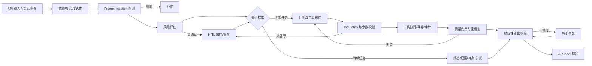

# MeetingMind 六链路架构对标与演进初步设计

> 状态：架构对标稿，待逐项确认，不代表已经完成代码改造  
> 日期：2026-08-26  
> 对标输入：/home/lenovo/A/new/架构初步设计.md  
> 项目边界：企业会议 AI 应用，不恢复已删除的机器人、多模态视觉、知识图谱、Multi-Agent 等非主线能力

## 0. 先给结论

当前 MeetingMind 不是“六条链路都没有”，而是已经形成了一条可运行的 LangGraph 主线，只是各层成熟度不均衡：

| 链路 | 当前判断 | 核心结论 |
|---|---|---|
| 输入预处理层 | 可用但边界分散 | 有接口校验、文档/音频处理、意图与复杂度路由、Prompt Injection 检测；缺少统一输入契约和对外部文档间接注入的完整防线 |
| 记忆层 | 有意保持轻量 | 有请求状态和有界会话记忆；没有持久检查点、任务实体记忆和长期记忆，这与此前项目瘦身方向一致 |
| 规划推理层 | 中等成熟 | 有结构化路由、模型分层、计划、预算、依赖、并行和重规划；计划契约缺少完成条件、证据要求和失败策略 |
| 工具调用执行层 | 六层中最强 | 有注册、元数据、参数校验、ToolPolicy、HITL、幂等、审计和 Jira；通用超时、熔断和统一失败对象仍不完整 |
| 反思校验层 | 有闭环但评测偏软 | 有确定性校验、局部修复、质量门禁、有限重规划和 Bad Case；证据一致性、故障分类和评测标定不足 |
| 输出层 | 有数据但缺统一出口 | 有结构化结果、引用、降级信息、脱敏和安全流式事件；普通/流式/批量响应契约不一致，也没有独立输出节点 |

从 AI 应用开发岗简历和 JD 角度，推荐：

1. **主项目选择“部分翻新”**，先做输入契约、可恢复状态、计划契约、证据化校验和统一输出，不重写已经较强的工具层，也不强行加入通用长期记忆。
2. **完整六链路作为后续独立学习项目**，前提是另选一个真正需要长任务、长期记忆和多工具恢复的业务场景，并建立评测集。
3. **不建议现在把 MeetingMind 六层全部推倒重做**。这会削弱已有 RAG、ToolPolicy/HITL、Jira、RabbitMQ、ASR、LoRA、Docker/CI 的闭环证据，容易得到“架构名词很多、真实业务更少”的项目。

因此不是简单三选一，而是明确的先后顺序：

**当前主决策：方案 2；学习扩展：方案 3；暂不采用：方案 1。**

## 1. 本次对标的边界

### 1.1 “2026 主流”不是一套统一六层标准

参考稿描述的是一种覆盖面较广的候选架构，不是已经被全行业共同采用的标准实现。当前官方资料呈现出的稳定共识主要是：

- 对确定性业务优先使用简单、可组合、可测试的工作流，只在任务确实不可预先分解时增加 Agent 自主性。Anthropic 将工作流和 Agent 明确区分，并建议从最简单可行方案开始。
- 状态化 Agent 要考虑检查点、暂停恢复、故障恢复和幂等，而不仅是保存几轮聊天。
- 高风险工具应在产生副作用**之前**校验权限并暂停审批，审批结果必须与具体调用绑定。
- 输入、输出和工具前后都需要护栏；单独一个过滤 LLM 不能替代确定性规则、权限隔离和最小授权。
- 质量不能只依赖模型自评，需要离线任务集、轨迹检查、确定性断言、人工标注和线上反馈组合。
- 长期记忆是按业务需要启用的数据产品，要有作用域、保留、删除、纠错、隐私和评测设计，不是 Agent 的默认必选组件。

本文件因此把“主流”定义为**可核验的工程能力集合**，而不是要求每一层都建成独立微服务。

### 1.2 本次没有做什么

- 没有修改六链路代码。
- 没有恢复已从 MeetingMind 删除的非 AI 应用岗主线能力。
- 没有把参考稿中的模块名直接当成待办清单。
- 没有声称真实 Jira、真实大模型、真实业务数据已经验证。
- 没有替用户决定长期记忆、模型供应商、存储方案和新项目业务域的最终细节。

## 2. 参考稿中需要先校正的六个观点

| 参考稿方向 | 校正后的工程判断 | 对 MeetingMind 的处理 |
|---|---|---|
| 异构模态统一 Token 空间 | 普通企业 Agent 更需要带来源、媒体类型、权限和信任级别的 Typed Artifact；自建统一 Token 空间成本高且难验证 | 保留文档与音频主线，不恢复图片帧、ROS；建立统一 InputEnvelope |
| 独立轻量过滤 LLM 隔离全部输入 | 可作为风险层之一，但过滤模型本身也可能受注入影响；必须叠加确定性校验、信任边界、最小工具权限和输出监控 | 保留规则 + 可选模型检测，补检索文档/工具结果的间接注入检查 |
| 长期演化记忆是完整 Agent 必备 | 长期记忆只有在跨会话个性化或经验复用能被业务指标证明时才值得引入 | 先做持久检查点与 TaskAnchor，不做通用用户画像和自动经验演化 |
| 输出完整推理依据、备选路径和置信度 | 不应暴露私有思维链；应记录可审计的决策摘要、规则命中、证据引用和动作原因 | 将 cot_thoughts 收敛为内部 trace；对外只给决策摘要和证据 |
| LLM 自报 0—1 置信度即可驱动流程 | 未校准的模型自评分不是概率；应依据检索覆盖、结构校验、证据一致性和标注集做校准 | 保留 route score 作路由信号，不把它包装成业务正确率 |
| 高危动作在输出层做最后确认 | 如果副作用已经发生，再确认没有意义；审批必须位于执行前，输出层只展示待执行动作和状态 | 当前 ToolPolicy/HITL 的位置更合理，应保留 |

## 3. 当前项目的真实六链路

### 3.1 当前主线图

代码依据：

- [唯一 LangGraph 主线](../backend/app/agents/graph.py#L13-L164)
- [Agent 状态与计划类型](../backend/app/agents/state.py)
- [Agent 请求执行和会话接入](../backend/app/agents/agent_service.py)
- [普通、流式、批量 API](../backend/app/api/v1/endpoints/agents.py)

### 3.2 成熟度口径

- **强**：主链已闭环，有明确契约/策略和测试证据；不等于生产环境已验证。
- **中**：功能可运行，但边界、持久性、评测或异常语义存在明显缺口。
- **弱**：只有局部能力或原型，不足以支撑对外简历表述。
- **缺失**：当前代码没有，且是否需要仍需业务确认。

## 4. 链路一：输入预处理层

### 4.1 对标后的合理目标

输入层不是“把所有东西变成 Token”，而是建立可信、可路由、可追踪的输入边界：

1. 接收用户问题、文档、音频转写及业务标识。
2. 校验大小、格式、用户/租户/会议/文档作用域。
3. 区分可信系统指令、用户指令和不可信文档/检索内容。
4. 生成结构化任务锚点：目标、硬约束、输出要求、歧义、允许的数据范围。
5. 根据任务类型、复杂度、上下文预算和风险选择工作流与模型。
6. 保存来源和信任级别，供后续检索、工具、校验和输出使用。

### 4.2 当前已经具备

- FastAPI 请求对问题长度、会话 ID、文档 ID 做基础类型校验。
- SessionContext 将 user/session/conversation/meeting/access scope 传入主链。
- 文档解析、语义切块、ASR 和 RAG 属于业务输入主线。
- IntentRouter、ComplexityClassifier、ModelRouter 已经形成“任务类型 × 复杂度”的双轴路由。
- PromptInjectionGuard 采用规则和可选 LLM 检测。
- ContentSafetyService 有文件检查和输出脱敏能力。
- PlanBudgetGuard 对计划提示和输出长度做预算保护。

主要代码：

- [AgentQueryRequest 与 SessionContext 接入](../backend/app/api/v1/endpoints/agents.py#L55)
- [统一意图路由](../backend/app/services/intent_router.py)
- [复杂度分类](../backend/app/services/complexity_classifier.py)
- [模型路由](../backend/app/services/model_router.py)
- [Prompt Injection 检测](../backend/app/services/prompt_injection_guard.py)
- [内容安全](../backend/app/services/content_safety.py)

### 4.3 关键缺口

1. **P0 状态字段丢失**：prompt_injection_node 写入 injection_blocked、injection_check、injection_block_reason 后再次调用 _sanitize_state，但清洗白名单未包含这些字段；graph.py 的条件路由可能读取不到阻断结果。现有测试也没有覆盖“恶意输入必须走 rejection_node”的图级断言。
2. 注入检测只检查用户 question，未对上传文档、RAG 片段和工具返回中的间接注入建立同等级信任边界。
3. 输入能力散落在 API、解析器、路由器和节点中，没有一个统一且版本化的 InputEnvelope。
4. 没有明确 TaskAnchor：用户目标、硬约束、完成标准、禁止动作仍分散在自然语言和 AgentState 字段里。
5. 路由 confidence 是启发式/模型信号，尚无标注集证明阈值与实际路由正确率的关系。
6. 当前上下文主要按字符截断和最近轮次拼接，缺少按证据、优先级和 token 预算的统一装配策略。

### 4.4 建议的 vNext 契约

| 字段组 | 建议字段 |
|---|---|
| identity | request_id、user_id、tenant_id、session_id、conversation_id |
| business scope | meeting_id、document_ids、access_scope |
| user intent | raw_query、normalized_goal、required_outputs、hard_constraints、ambiguities |
| artifacts | artifact_id、media_type、source、trust_level、content_ref、checksum |
| routing | task_type、complexity、workflow、model_tier、route_evidence |
| budget | max_steps、max_tool_calls、token_budget、deadline |
| security | injection_status、policy_flags、redaction_flags |
| versioning | input_schema_version、router_version |

这不是最终字段表，后续应由用户逐项确认哪些字段真正服务 MeetingMind 演示。

### 4.5 学习重点与验收问题

- 能否解释 direct prompt injection 和 indirect prompt injection 的区别？
- 为什么“过滤模型”不能替代权限边界？
- 路由错误率如何用标注集评估，而不是看几条成功日志？
- 同一份不可信文档如何在检索、规划、工具参数和最终输出之间保持来源标签？
- 验收至少应包含：图级注入阻断测试、间接注入测试、越权文档测试、路由混淆矩阵和 token 预算回归。

## 5. 链路二：记忆层

### 5.1 对标后的合理目标

需要先分清四种容易混淆的对象：

| 对象 | 作用域 | MeetingMind 当前状态 |
|---|---|---|
| Graph State | 单次运行的步骤、计划、工具结果、校验状态 | 已有 AgentState，但不持久 |
| Short-term Memory | 同一对话的最近交互 | 已有进程内有界 LRU |
| Knowledge Base | 可检索的会议文档事实 | 已有 RAG，不应称为长期记忆 |
| Long-term Memory | 跨会话偏好、经验和规则 | 未实现，也暂未证明业务必要性 |

主流方向中最值得当前项目补足的不是“自动演化记忆”，而是**可恢复的运行状态**。

### 5.2 当前已经具备

- ShortTermMemory 只保存固定轮数的问答。
- SessionMemoryStore 同时限制每个会话轮数和总会话数，并按 LRU 淘汰。
- thread_id 包含 user_id，避免不同用户共享会话记忆。
- HITL 服务会把待确认的 resume_state 暂存 Redis。
- RAG 数据有业务域与访问范围，不和聊天记忆混用。

主要代码：

- [有界会话记忆](../backend/app/agents/memory.py)
- [会话与线程身份](../backend/app/agents/session_context.py)
- [HITL 暂停状态](../backend/app/agents/human_in_the_loop.py)
- [记忆单元测试](../backend/tests/unit/test_memory.py)

### 5.3 关键缺口

1. graph.compile() 没有 checkpointer，普通 Agent 运行不能在进程重启后从节点级检查点恢复。
2. Redis HITL resume_state 是自定义旁路，和 LangGraph 主状态持久化不是同一个生命周期模型。
3. 没有 TaskAnchor/TaskMemory 来持久表达目标、约束、完成条件、已验证事实和失败状态。
4. 短期记忆只是最近三轮文本拼接，没有摘要、重要性或来源筛选。
5. 没有长期记忆的写入、纠错、删除、保留期、租户隔离和质量评测；在这些问题未定义前，不应贸然实现。

### 5.4 推荐改造边界

**主项目要做：**

- 引入生产可替换的 LangGraph checkpointer，让暂停、恢复、失败重试和调试共享同一 thread/run 语义。
- 将 TaskAnchor 作为 AgentState 的版本化子结构，而不是建立一套独立“记忆大脑”。
- 对历史上下文做轻量摘要/裁剪，但保留来源和当前任务相关性。
- 定义保留时间、删除接口、租户 namespace 和敏感字段策略。

**主项目暂不做：**

- 自动推断并永久保存用户性格或偏好。
- 把每次反思结论自动写成跨会话经验。
- 独立 Memory Writer、Compactor、Retriever、Filter、Evolver 五服务。
- 在没有评测集时使用向量相似度自动召回“历史经验”影响当前决策。

### 5.5 学习重点与验收问题

- checkpoint、短期记忆、知识库、长期记忆分别解决什么问题？
- 工具已经执行成功、进程随后崩溃时，恢复如何避免重复副作用？
- 用户要求删除历史数据时，哪些存储必须同步删除？
- 长期记忆写错后如何纠正，如何避免污染后续任务？
- 验收至少应包含：中断恢复、进程重启恢复、同用户跨线程/不同用户隔离、过期删除和重复执行幂等测试。

## 6. 链路三：规划推理层

### 6.1 对标后的合理目标

规划层应在“固定工作流”和“动态 Agent”之间做有证据的选择：

1. 简单会议问答、纪要、待办和争议抽取走确定性路径。
2. 只有多交付物、未知步骤或工具组合任务才生成计划。
3. 计划中的每一步都必须有输入、输出、依赖、完成条件、风险和允许工具。
4. 重规划由结构失败、工具失败、证据不足或预算超限触发，并有最大次数。
5. 对外解释的是决策摘要和证据，不是私有思维链。

### 6.2 当前已经具备

- RouteDecision 统一输出任务类型、复杂度、候选、路由原因、模型档位和降级信息。
- 简单任务走固定节点，复杂任务才进入 plan_node。
- Plan 包含 tasks、execution_order、parallel_groups 和 tool_calls。
- PlanBudgetGuard 限制任务数并检查计划结构。
- ParallelExecutor 支持依赖和并行任务。
- replan_node 能生成 repair_plan，并将缺失交付物映射回必需工具。
- 重规划和局部修复都有次数边界。

主要代码：

- [路由与计划节点](../backend/app/agents/nodes.py#L714)
- [计划结构](../backend/app/agents/state.py)
- [计划预算门禁](../backend/app/services/plan_budget_guard.py)
- [并行执行器](../backend/app/services/parallel_executor.py)
- [路由与工具安全测试](../backend/tests/agent/test_workflow_router.py)

### 6.3 关键缺口

1. PlanTask 缺 expected_output、completion_criteria、evidence_requirements、failure_policy、side_effect 和 compensation。
2. planner 的 analysis 和 cot_thoughts 命名仍容易被误解为可交付思维链；当前 API 已不返回 thoughts，但内部模型需要重命名为 decision_record/trace。
3. 路由、规划、执行、修复大量逻辑集中在 nodes.py，文件职责过大，层间契约难单测。
4. parallel_groups 来自模型输出，但尚未看到针对数据竞争、资源上限和共享状态写入的系统级约束。
5. “模型档位更高是否更好”尚无真实 token、延迟、成本与质量对比数据。
6. 重规划质量主要依赖当前回答预览和模型评分，对工具轨迹与证据覆盖读取不足。

### 6.4 建议的 vNext 计划结构

| 字段 | 用途 |
|---|---|
| plan_id / schema_version | 支持审计、恢复和升级 |
| goal_ref | 指向不可随意漂移的 TaskAnchor |
| step_id / dependencies | 表达 DAG |
| action_type / tool_name | 区分纯计算、检索、外部读、外部写 |
| inputs / expected_output | 明确上下游契约 |
| completion_criteria | 让校验层判断业务成功，而非只看 status |
| evidence_requirements | 指定结论需要哪些来源 |
| risk / approval_policy | 执行前权限决策 |
| retry_policy / failure_policy | 区分重试、重规划、终止 |
| budget | 每步 token、时长、工具调用上限 |

### 6.5 学习重点与验收问题

- 什么场景应走 deterministic workflow，什么场景才值得 plan-execute？
- 如何证明并行带来收益，而不是只展示 parallel_groups 字段？
- 计划结构变化后，旧检查点如何恢复？
- 重规划如何避免重新执行已经成功的外部写？
- 验收至少应包含：计划 Schema 契约测试、DAG 合法性、最大步数、预算耗尽、失败分类和恢复幂等测试。

## 7. 链路四：工具调用执行层

### 7.1 对标后的合理目标

工具层的核心不是工具数量，而是“模型建议动作”到“受控副作用”的可信边界：

1. 注册表只暴露实际可执行、当前用户有权调用的工具。
2. 入参先做结构校验，再做业务校验和权限校验。
3. 外部写在执行前完成审批，并将审批绑定到调用身份和参数。
4. 只对明确幂等或可安全重试的操作重试。
5. 每次调用输出统一 ToolResult，记录状态、数据、耗时、错误分类和审计 ID。
6. 对超时、并发、速率和故障传播设置边界。

### 7.2 当前已经具备

- ToolRegistry、ToolMetadata、ToolSelector、ToolManager、ToolPolicy 和 ToolExecutor 职责已经基本成形。
- 工具元数据包含参数、风险、工作流范围、外部副作用、是否确认、是否幂等等字段。
- 模型工具调用先通过 Pydantic 外壳和工具参数定义校验。
- 外部写要求 idempotency_key；审计不可用时 fail closed。
- 高风险/外部写在执行前进入 HITL，批准与单个 idempotency_key 绑定。
- Jira create 不自动重试，幂等 read/update 能按错误类型重试。
- 工具结果有 ToolExecutionResult，并能写回结构化业务输出。

主要代码：

- [工具管理与持久审计](../backend/app/agents/tools/manager.py)
- [执行前 ToolPolicy](../backend/app/agents/tools/policy.py)
- [工具执行器](../backend/app/agents/tools/executor.py)
- [工具元数据与结果](../backend/app/agents/tools/tool_metadata.py)
- [Jira 真实 HTTP 客户端](../backend/app/agents/tools/enterprise_tools.py)
- [工具审计服务](../backend/app/services/tool_audit_service.py)
- [阶段 2 工具安全契约测试](../backend/tests/contracts/test_stage2_tool_safety.py)

### 7.3 关键缺口

1. ToolMetadata 声明了 timeout，但通用 ToolExecutor 没有使用 asyncio.wait_for 或同类机制强制每个工具超时；当前只有部分客户端自带 HTTP 超时。
2. 通用执行器对所有异常做指数退避，是否重试主要由外层 retry_count 决定，错误分类与重试策略仍可进一步统一。
3. 没有通用 circuit breaker、bulkhead、per-tool concurrency/rate limit。
4. ToolExecutionResult 的错误分类、原始响应摘要、重试次数和业务成功判定仍不完全统一。
5. base.py 与新 registry/executor 体系存在历史同名抽象，增加阅读成本，后续应确认是否仍有真实调用后再清理。
6. Jira 的真实账号、权限、速率限制、审计一致性和恢复仍需真实环境验证。

### 7.4 推荐改造边界

工具层不需要翻新，只做可靠性收口：

- 落实 metadata.timeout。
- 统一 ErrorCategory：validation、permission、timeout、network、rate_limit、upstream、business、unknown。
- 明确每类错误的 retry/replan/stop 决策。
- 为工具执行增加并发上限和可选熔断。
- 让 ToolResult 携带 attempt_count、audit_id、external_id、evidence_refs。
- 保留当前执行前 HITL，不把审批挪到输出之后。

### 7.5 学习重点与验收问题

- 为什么非幂等 create 在网络超时后不能盲目重试？
- 审批如何绑定工具名、参数、用户、租户和本次运行？
- HTTP 200 但返回空 issue key，算工具成功还是业务失败？
- 熔断、超时、重试和重规划分别在哪一层负责？
- 验收至少应包含：非法参数、越权、未审批写、审批参数篡改、超时、429、5xx、重复请求和审计故障测试。

## 8. 链路五：反思校验层

### 8.1 对标后的合理目标

“反思”不应等于让同一个模型再说一次好不好，而应是分层质量门禁：

1. 确定性结构校验：字段、类型、必填项、数量、状态机。
2. 业务完成校验：是否满足 TaskAnchor 和每个 PlanStep 的完成条件。
3. 证据一致性：结论能否由检索片段或工具结果支撑。
4. 安全与权限复核：是否存在越权、敏感信息或未批准副作用。
5. 失败归因：输入不足、检索失败、计划错误、工具错误、输出格式错误、不可恢复。
6. 有界决策：pass、local_repair、retry_tool、replan、human_review、stop。
7. Bad Case 进入可复现评测集，而不是自动污染长期记忆。

### 8.2 当前已经具备

- direct 和 complex 分支最终都进入 validate_node。
- validate_node 做确定性输出结构检查，并在输出前脱敏。
- repair_node 只做低风险局部结构修复，最大次数受限。
- complex 分支使用统一 QualityGate，按维度加权并决定 polish/replan/pass。
- replan_node 生成结构化 repair_plan，最多有限次重试。
- FeedbackService 支持反馈、Bad Case、改进记录和验证状态。

主要代码：

- [质量门禁](../backend/app/services/quality_gate.py)
- [校验、修复和重规划节点](../backend/app/agents/nodes.py#L1797)
- [反馈与 Bad Case](../backend/app/services/feedback_service.py)
- [质量门禁测试](../backend/tests/agent/test_quality_gate.py)

### 8.3 关键缺口

1. 当前 LLM Judge 读取的主要是问题和输出预览，没有系统检查每条结论与 citation/tool result 的对应关系。
2. quality_score 由单次模型评估和固定权重构成，尚未用人工标注集做一致性、偏差和阈值校准。
3. replan_agent 将 quality_score 同时写成 confidence，语义上把“质量估计”误作“置信度”。
4. 故障信息主要是字符串列表，缺少可机读 FailureReport 和明确 owner layer。
5. direct 分支主要走确定性 validate/repair，complex 分支额外走 QualityGate；两类任务的质量口径不统一。
6. Bad Case 虽能入库，但还缺从线上反馈到固定回归集、版本对比、发布门禁的完整流水线。

### 8.4 建议的 vNext 决策结构

| 字段 | 示例 |
|---|---|
| decision | pass / repair / retry_tool / replan / human_review / stop |
| failure_category | evidence_missing / tool_timeout / permission_denied |
| owner_layer | input / memory / planning / tool / reflection / output |
| failed_criteria | completion_criteria 的标识列表 |
| evidence_coverage | 已覆盖与未覆盖的结论 |
| retryable | true / false |
| retry_budget_left | 剩余次数 |
| user_message | 可安全对外展示的失败说明 |
| evaluator_version | 规则、提示、模型和数据集版本 |

### 8.5 学习重点与验收问题

- LLM-as-judge 的一致性如何测量？
- 哪些指标可用确定性代码判断，哪些才需要模型？
- 如何防止 evaluator 和 generator 共享同样偏差？
- 什么时候局部修复，什么时候必须重规划？
- 验收至少应包含：引用支持率、字段正确率、任务完成率、工具轨迹合规率、重试成功率、误重试率和人工抽检一致性。

## 9. 链路六：输出层

### 9.1 对标后的合理目标

输出层应提供一个统一、版本化、可公开的交付契约：

1. 聚合已验证的业务结果，不暴露私有思维链、原始提示、凭据和堆栈。
2. 明确 complete、partial、pending_approval、failed、rejected。
3. 同时支持人类可读内容和机器可读 payload。
4. 携带引用、证据覆盖、降级、未完成项和可执行的下一步。
5. 普通、流式和批量接口共享同一核心 OutputEnvelope。
6. 对外 confidence 必须有定义和校准；否则只展示 evidence coverage 和 degradation。

### 9.2 当前已经具备

- AgentResult 不再返回内部 thoughts。
- SSE 把内部 thought 事件转换为公开 progress，只保留 phase/action/step。
- StructuredOutputEnvelope 带 schema/prompt/model 版本、来源、不确定项和降级信息。
- RAG 输出有 citations 和 degradation。
- validate_node 在输出前做手机号、邮箱、证件号、凭据等脱敏。
- API 返回路由、检索、策略、确认和业务结果，便于演示主链。

主要代码：

- [Agent 结果装配](../backend/app/agents/agent_service.py#L231)
- [API 与 SSE 输出](../backend/app/api/v1/endpoints/agents.py#L105)
- [结构化输出契约](../backend/app/schemas/structured_output.py)
- [RAG 输出契约](../backend/app/schemas/rag.py)

### 9.3 关键缺口

1. 普通 query、query-stream、batch 三个端点返回字段不一致；流式最终结果缺少 structured_outputs、route_decision 和部分元数据。
2. graph 没有独立 output_node，输出装配分散在 AgentService 和 API。
3. AgentService 在图未抛异常时直接 success=True；pending confirmation、validation_errors 或部分失败与 success 的语义可能冲突。
4. 没有统一 status/partial_results/missing_requirements/next_actions。
5. route_confidence、retrieval_confidence、reflection quality_score 的含义不同，但接口上容易被用户理解成同一种“答案可信度”。
6. 对外 plan 仍包含 analysis，需要确认它是安全决策摘要还是模型内部分析；默认不应暴露私有推理。

### 9.4 建议的 vNext 输出结构

| 字段组 | 建议字段 |
|---|---|
| lifecycle | run_id、status、completed_steps、failed_steps |
| human view | message、warnings、next_actions |
| machine view | output_type、payload、schema_version |
| provenance | citations、tool_audit_ids、evidence_coverage |
| uncertainty | missing_requirements、degradation、limitations |
| approval | pending_action、approval_request_id、expires_at |
| metrics | latency_ms、token_usage、model_tier；不默认输出伪置信度 |

### 9.5 学习重点与验收问题

- partial success 与 failed 如何区分？
- SSE 断线重连后如何获取同一个最终结果？
- 什么信息可作为可解释性输出，什么属于不能外泄的内部推理？
- 引用存在是否等于结论被引用支持？
- 验收至少应包含：三端点契约一致性、脱敏、无思维链泄露、部分失败、待审批、拒绝和降级输出测试。

## 10. 六层横向差距与优先级

| 优先级 | 问题 | 影响链路 | 先解决的原因 |
|---|---|---|---|
| P0 | 注入阻断字段被状态清洗丢弃 | 输入 → 图路由 | 安全节点可能名义存在、实际不阻断 |
| P0 | success 与 pending/partial/validation error 语义不统一 | 反思 → 输出 | 演示和 API 消费方可能误判结果 |
| P0 | 通用工具 timeout 元数据未被执行器落实 | 工具 → 反思 | 单个工具可能拖住整条链 |
| P1 | 缺统一 TaskAnchor/InputEnvelope | 输入 → 规划 → 校验 | 目标、约束和完成标准无法贯穿六层 |
| P1 | 缺持久 graph checkpoint | 记忆 → HITL → 工具 | 暂停恢复和故障恢复不是统一模型 |
| P1 | PlanStep 缺完成条件和证据要求 | 规划 → 反思 | 校验层只能靠输出形态和模型评分 |
| P1 | 缺 FailureReport/ValidationDecision | 工具 → 反思 → 输出 | 重试、重规划和终止难稳定自动化 |
| P1 | 三种 API 缺统一 OutputEnvelope | 输出 | 接口、前端和演示口径不一致 |
| P2 | 间接注入与上下文信任标签不足 | 输入 → 工具 | RAG/工具内容可能携带隐藏指令 |
| P2 | 缺版本化回归评测流水线 | 全链路 | 无法证明改造真正提升 |
| P3 | 通用长期记忆 | 记忆 | 当前业务收益未证明，隐私与污染风险高 |

## 11. 三种路线的 JD 与简历价值比较

### 11.1 评分口径

- 学习深度：是否能亲手理解边界条件和失败模式。
- JD 命中：是否对应常见 AI 应用岗位的 RAG、Agent 编排、工具调用、安全、评测、部署能力。
- 简历可信度：是否能用真实场景、指标、测试和演示支撑，而不是只列组件。
- 交付风险：是否容易因范围过大造成长期不可演示。
- 项目叙事：面试时是否能在几分钟内讲清问题、取舍、实现和结果。

### 11.2 路线对比

| 方案 | 学习覆盖 | JD/简历价值 | 成本与风险 | 判断 |
|---|---|---|---|---|
| 1. 当前项目六链路全部翻新 | 广，但容易每层只学表面 | 组件名多；若缺数据和指标，可信度反而下降 | 最高；会重开已收敛范围，破坏现有稳定主线 | 不推荐当前采用 |
| 2. 当前项目部分翻新 | 聚焦关键工程边界，深度最好 | 最容易形成“发现问题—设计契约—测试验证—指标改进”的面试证据 | 可控；能保留当前 RAG/Jira/队列/ASR/部署成果 | 当前最推荐 |
| 3. 保持当前项目，另建完整六链路项目 | 理论覆盖最好，能自由尝试长期记忆和动态计划 | 两项目能体现产品交付 + 架构探索，但必须避免两个半成品 | 总投入大于方案 1，且会分散维护和演示精力 | 作为方案 2 之后的学习项目 |

### 11.3 方案 1：为什么不建议

如果把参考稿逐项落地，MeetingMind 会重新引入：

- 与会议业务无关的通用多模态/具身适配。
- 尚无用户需求和验收指标的长期演化记忆。
- 过度通用的动态任务树、并行和多层控制器。
- 多个新的存储、评测和隐私问题。

简历上“实现六层复杂 Agent 架构”很容易被追问：

- 为什么会议纪要需要长期演化记忆？
- 记忆写错怎么回滚？
- 动态规划比固定工作流提升了多少？
- confidence 如何校准？
- 六层每层有什么真实测试和业务指标？

如果答不出，这条路线会降低而非提高可信度。

### 11.4 方案 2：推荐的主项目翻新范围

建议把工作拆为“修正确性 + 四个重点翻新 + 两个保留收口”：

**先修正确性：**

1. 修复注入状态丢失并增加图级安全测试。
2. 落实通用工具超时和错误分类。
3. 统一 success/status/partial/pending 的语义。

**重点翻新：**

1. 输入层：InputEnvelope + TaskAnchor + 不可信内容标签。
2. 规划层：PlanStep 完成条件、证据要求、失败策略和预算。
3. 反思层：ValidationDecision + FailureReport + 证据覆盖校验。
4. 输出层：统一 OutputEnvelope 和独立 output_node。

**保留并收口：**

1. 记忆层：增加持久 checkpoint，但继续保持有界短期记忆，不上通用长期记忆。
2. 工具层：保留现有 ToolPolicy/HITL/幂等/审计结构，只补超时、并发和错误语义。

这条路线最适合形成以下简历表述，但必须在实现和实测后才能使用：

> 基于 LangGraph 将会议 Agent 收敛为契约驱动的可恢复工作流，贯通输入信任边界、结构化计划、ToolPolicy/HITL、幂等审计、证据化质量门禁和统一输出；通过固定回归集评估任务完成率、引用支持率、工具轨迹合规率及恢复成功率。

### 11.5 方案 3：什么时候值得另建项目

只有在以下条件同时成立时再开始：

1. MeetingMind 的方案 2 已完成并可稳定演示。
2. 新项目的业务任务确实跨小时/跨会话，必须暂停恢复。
3. 长期记忆有明确消费者和可测收益。
4. 至少有三类外部工具、读写权限差异和失败恢复场景。
5. 有固定任务集和成本/质量/延迟基线。

新项目不应再做“另一个会议助手”。更适合的学习题目是：

- 研发事件处置 Agent：读取告警和日志、形成调查计划、调用只读诊断工具、生成变更建议、审批后执行工单。
- 长周期研究任务 Agent：分阶段检索、保存任务锚点、跨会话恢复、证据去重、人工确认结论。
- 企业流程执行 Agent：读取表单、校验规则、调用多个业务系统、审批外部写、失败补偿。

新项目应突出 MeetingMind 没有必要承载的能力：持久 Task Memory、跨会话长期记忆、长任务恢复、工具隔离、动态 DAG 和评测驱动的 memory evolution。

## 12. 推荐实施顺序（待用户逐项确认）

### 阶段 A：先建立不可争议的契约和测试

- 修复三个 P0。
- 为六层定义最小输入/输出对象，不先增加服务。
- 建立 30—50 条小型金标任务集，覆盖问答、纪要、待办、多交付物、越权、注入、工具超时和待审批。
- 固定当前质量、延迟、工具调用数和 token 基线。

退出条件：相同输入能稳定得到可比较的状态、轨迹和输出。

### 阶段 B：翻新输入与规划

- 增加 InputEnvelope 和 TaskAnchor。
- 对用户输入、文档、检索片段、工具结果标注 trust_level。
- 扩展 PlanStep 契约。
- 保持简单任务固定路由，只给复杂任务动态计划。

退出条件：每个计划步骤都有完成条件和证据要求；路由有离线混淆矩阵。

### 阶段 C：统一持久状态与执行恢复

- 接入可替换 checkpointer。
- 将 HITL 暂停恢复与 graph state 对齐。
- 验证进程中断、恢复、幂等和旧版本状态处理。

退出条件：外部写前暂停，重启后恢复，且不会重复创建 Jira issue。

### 阶段 D：翻新反思与输出

- 建立 FailureReport 和 ValidationDecision。
- 将证据覆盖、结构校验和权限轨迹作为主要门禁。
- LLM Judge 只处理难以确定性判断的维度，并用标注集校准。
- 增加统一 output_node 和 OutputEnvelope。

退出条件：普通、流式、批量输出语义一致；每个失败都能明确由哪层处理。

### 阶段 E：决定是否建立独立学习项目

- 复盘主项目中仍未学到的能力。
- 选择确实需要长期记忆和长任务恢复的业务域。
- 先写任务集、权限模型和验收指标，再建框架。

退出条件：能用一个独立业务问题解释为什么六层完整实现是必要的。

## 13. 用户后续需要亲自确认的细节

### 输入层

- MeetingMind 的输入最终只保留文本、PDF/DOCX 和音频，还是确有图片需求？
- 外部文档中的指令是否一律视为数据？
- 哪些歧义必须询问用户，哪些可以保守默认？

### 记忆层

- 是否要求刷新页面或服务重启后恢复同一对话？
- 是否真的存在跨会议偏好或规则？由谁写入、谁审核、保存多久？
- 用户能否查看、纠正和删除记忆？

### 规划层

- 哪些业务请求允许动态计划？
- 每类任务的完成标准和最大调用次数是什么？
- 是否需要并行，能用什么指标证明它有价值？

### 工具层

- Jira read/create/update 的真实权限和审批规则是什么？
- 哪些操作可撤销、幂等或需要补偿？
- 超时后“未知是否成功”的外部写如何人工处理？

### 反思层

- 谁提供金标答案和 citation 支持关系？
- 质量门禁主要优化准确率、完整率、引用支持率还是成本？
- 低质量时是自动重试、询问用户还是停止？

### 输出层

- 前端和下游 API 真正需要哪些格式？
- partial、pending、failed 应如何向用户展示？
- 是否需要展示计划摘要；如果需要，哪些字段可公开？

## 14. 面向 AI 应用开发岗的最终项目叙事

主项目应该讲成一条可验证的业务链，而不是六个孤立模块：

> MeetingMind 将会议文档与音频转成可检索证据，通过任务与复杂度双轴路由选择确定性工作流或计划执行；外部工具调用经过参数校验、最小权限、HITL、幂等和持久审计；结果再经结构、证据与安全门禁输出统一的可溯源响应，并使用固定评测集和 Bad Case 回归驱动迭代。

面试中优先展示：

1. 为什么简单任务不用通用 Agent。
2. 一个恶意输入如何被输入边界拦截。
3. 一个 Jira create 如何完成审批、幂等和审计。
4. 一次中断如何恢复且不重复副作用。
5. 一个错误答案如何通过证据校验进入修复、重规划或停止。
6. 改造前后任务完成率、引用支持率、恢复成功率、P95 延迟和 token 成本如何变化。

不应在尚未实测时宣称：

- 已实现生产级长期记忆或自动记忆演化。
- confidence 等于答案真实正确率。
- 已支持通用多模态或具身 Agent。
- 已完成高可用生产部署。
- 真实 Jira/LLM/业务数据已经全量验证。

## 15. 参考依据

以下资料用于校准参考稿，不表示项目必须绑定某个供应商：

- [Anthropic：Building effective agents](https://www.anthropic.com/engineering/building-effective-agents)：区分确定性工作流与自主 Agent，强调从简单可组合模式开始，并给出 routing、parallelization、orchestrator-workers、evaluator-optimizer 等适用条件。
- [Anthropic：Demystifying evals for AI agents](https://www.anthropic.com/engineering/demystifying-evals-for-ai-agents)：说明 Agent 评测需要覆盖多轮工具轨迹、状态变化和真实任务结果。
- [LangGraph：Persistence](https://docs.langchain.com/oss/python/langgraph/persistence)：检查点支持 HITL、会话记忆、故障恢复和回放；跨线程长期记忆使用独立 Store。
- [LangGraph：Memory overview](https://docs.langchain.com/oss/python/concepts/memory)：区分 thread-scoped short-term memory 与跨线程 long-term memory，并说明长上下文的成本和干扰问题。
- [LangChain：Human-in-the-loop](https://docs.langchain.com/oss/python/langchain/human-in-the-loop)：高风险工具在执行前按策略暂停，支持 approve/edit/reject，生产环境需要持久 checkpointer。
- [OpenAI Agents SDK：Guardrails](https://openai.github.io/openai-agents-python/guardrails/)：区分输入、输出和工具前后护栏，说明单一边界护栏不足以覆盖工具链。
- [OpenAI Agents SDK：Human-in-the-loop](https://openai.github.io/openai-agents-python/human_in_the_loop/)：审批与具体工具调用绑定，暂停状态可序列化并恢复。
- [OpenAI Agents SDK：Tracing](https://openai.github.io/openai-agents-python/tracing/)：端到端记录模型调用、工具调用、护栏和自定义事件，用于调试和生产监控。
- [OWASP：LLM Prompt Injection Prevention Cheat Sheet](https://cheatsheetseries.owasp.org/cheatsheets/LLM_Prompt_Injection_Prevention_Cheat_Sheet.html)：过滤模型应与确定性控制组合，并对 RAG 文档、网页、工具结果等不可信上下文做间接注入防护。
- [OWASP：Agentic AI 权限控制示例](https://cornucopia.owasp.org/edition/companion/AAI9)：建议最小工具权限，并按可逆性和副作用对动作分级审批。

## 16. 本文的决策状态

| 决策 | 当前状态 |
|---|---|
| 当前项目主路线采用方案 2 | 建议，待用户确认 |
| 当前项目增加通用长期记忆 | 不建议，除非补充业务需求和评测目标 |
| 当前项目六层全部推倒重做 | 不建议 |
| MeetingMind 稳定后建立独立六链路学习项目 | 建议，待确定业务域 |
| 立即修改代码 | 不在本文范围，需按链路逐项确认后执行 |
