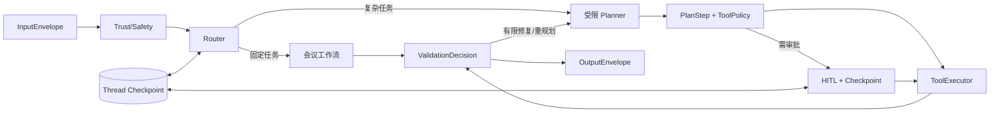

# MeetingMind 六链路架构对标与演进设计（第二版）

> **历史版本**：本文记录第二版路线判断，部分“待实施”和“下一步”已经被后续代码与当前状态文档覆盖。当前口径以[当前状态与下一步（大白话）](../当前状态与下一步_大白话.md)、[项目总览（大白话）](../项目总览_大白话.md)及各层技术说明为准。

> 日期：2026-08-26
>
> 状态：路线已收敛，具体实现细节仍待逐项确认
>
> 第一版归档：[六链路架构对标与演进设计（第一版）.md](./六链路架构对标与演进设计（第一版）.md)
>
> 第一版 SHA-256：09eb5e2577ae7cc37cdabf1616be8730dced0c8cc0b5814b09cee8ee3e0a5bef
>
> 版本约束：第一版作为复盘基线保持不变；第二版只记录新的路线判断

## 0. 第二版相对第一版的变化

第二版确认三项新决策：

1. 接受“先部分翻新 MeetingMind，再设计第二个项目”的建议。
2. MeetingMind 继续以 Python AI 应用栈为主；第二项目以 Java 企业应用栈为主。
3. 不再照搬参考稿的六链路，而是先重新定义一套更稳健的工业六链路，再分别映射到两个项目。

当前总路线为：

**MeetingMind 定向翻新 → 真实数据与 Demo 验收 → 再启动 Java 第二项目。**

第二版不会为了展示技术数量，把两个项目都做成相同的“RAG + Agent + 一堆中间件”。两者应该共享安全、契约、评测等正确原则，但在业务问题、运行模型和技术重点上明显不同。

## 1. 已确定与仍待确定的事项

### 1.1 已确定

- MeetingMind 不做六链路推倒重写，只做影响正确性、可恢复性和可评测性的部分翻新。
- MeetingMind 保持 Python 主栈，不混入 Java 微服务。
- 第二项目以 Java 为主，建议采用 Java LTS、Spring Boot、Spring AI 和 Temporal Java SDK。
- 第二项目不重复 MeetingMind 的会议、ASR、LoRA 和深度 RAG 主题。
- 第二项目重点学习长任务、持久工作流、多系统工具、审批、恢复、事件和企业可观测。
- 两个项目都必须有真实任务、测试、失败边界和演示，不能只停留在架构图。

### 1.2 当前不阻塞第二版、但启动第二项目前需确认

| 待确认事项 | 第二版默认建议 |
|---|---|
| 第二项目业务域 | 研发/运维事件处置 Agent |
| Java AI 框架 | Spring AI；暂不同时引入 LangChain4j |
| 长任务运行时 | Temporal Java SDK |
| 消息系统 | 初版不强制 Kafka；出现真实领域事件和多消费者后再加入 |
| 工具协议 | 本地关键工具用强类型接口；跨系统动态工具再选择 MCP |
| 检索系统 | 不复制 MeetingMind 的 Milvus 深度 RAG；按事件场景选择 PostgreSQL 或 OpenSearch |
| Python 是否完全消失 | Java 是控制面主语言；必要的模型训练/特殊推理允许独立 Python 服务 |

这些默认值足以完成路线设计，暂时不需要用户先回答。真正创建第二项目仓库前再确认即可。

## 2. Python 主项目 + Java 第二项目是否可行

结论：**可行，而且比两个 Python Agent 项目更有区分度。**

### 2.1 为什么 MeetingMind 继续用 Python

MeetingMind 的核心价值靠近 AI 能力本身：

- 文档解析、Embedding、Reranker 和 RAG 评测。
- LangGraph 的状态图与路由实验。
- FunASR 音频处理。
- Transformers、PEFT、LoRA/QLoRA 实验。
- 模型调用、Prompt、结构化抽取和数据集迭代。

这些能力与 Python 生态结合最自然。现在改成 Java 会重写大量已验证代码，却不会增加会议业务价值。

### 2.2 为什么第二项目适合 Java

第二项目的核心价值应靠近企业 Agent 工程：

- 强类型业务对象和接口契约。
- Spring Security、事务、数据访问和企业集成。
- 长任务状态机、超时、重试、暂停、恢复和版本升级。
- 多系统工具调用、审批、审计和补偿。
- Micrometer/OpenTelemetry 可观测。
- Spring AI 对模型、工具、记忆、RAG、结构化输出、评估和 MCP 的统一接入。

Java 不需要负责所有模型训练。更合理的分层是：

| 平面 | 主语言 | 职责 |
|---|---|---|
| Agent 控制面 | Java | API、身份、工作流、计划、工具策略、HITL、审计、输出 |
| 模型访问面 | Java | 通过 Spring AI 调用外部模型、Embedding 和 Evaluator |
| 特殊模型面（可选） | Python | 训练、专用推理、离线数据处理，以 HTTP/gRPC 服务接入 |

这样既体现 Java 企业开发能力，也保留 AI 工程的现实边界。

### 2.3 不应为了区分而强行不同的能力

以下原则两个项目都必须具备：

- 输入和输出 Schema。
- 身份、租户和最小权限。
- 高风险工具执行前审批。
- 幂等、超时、重试边界和审计。
- 不暴露私有思维链。
- 固定评测集和 Bad Case 回归。
- 可观察的模型、工具和状态轨迹。

项目区分度应来自业务和运行模型，不应通过删除必要安全能力制造差异。

## 3. 两个项目的定位与技术区分

| 维度 | MeetingMind | 第二项目 |
|---|---|---|
| 项目定位 | 会议知识 AI 垂直应用 | 企业长流程 Agent / 事件处置平台 |
| 主语言 | Python | Java |
| 核心框架 | FastAPI + LangGraph | Spring Boot + Spring AI + Temporal |
| Agent 风格 | 工作流优先、单 Agent、受限计划 | 持久工作流为底座，局部使用 Agent 计划 |
| 典型任务时长 | 秒到分钟 | 分钟到数天，可跨进程等待 |
| 主要输入 | 文档、WAV、会议问题 | 告警、事件、工单、日志、人工反馈 |
| AI 重点 | RAG、路由、抽取、ASR、LoRA | 长任务编排、工具治理、恢复、审批、评测 |
| 检索重点 | PostgreSQL 关键词 + Milvus Dense + Reranker | 事件/工单检索；按需使用 PostgreSQL 或 OpenSearch |
| 记忆 | 有界会话 + 轻量检查点 | Temporal 运行历史 + 任务实体 + 受治理领域记忆 |
| 工具 | 固定会议工具 + Jira | 多企业系统，强类型工具 + 可选 MCP |
| 异步 | RabbitMQ 处理文档和 ASR 作业 | Temporal Task Queue；Kafka 仅用于必要的领域事件 |
| 反思 | 证据化会议输出校验 | 规则、SLO、工具轨迹和独立 Evaluator |
| 输出 | 回答、纪要、待办、引用、SSE | 状态快照、处置报告、审批、Webhook/事件 |
| 主要面试价值 | AI 应用算法与业务闭环 | Java 企业架构与 Agent 可靠执行 |

### 3.1 两个项目不重复建设的原则

MeetingMind 独占重点：

- FunASR、音频证据、会议分块。
- Milvus 混合检索与 BGE Reranker。
- LoRA/QLoRA 教学实验。
- LangGraph 业务图。

第二项目独占重点：

- Temporal 持久工作流和事件历史。
- Java 强类型领域模型。
- Spring Security 与企业权限。
- 多日任务、Signal/审批、恢复、补偿和工作流版本。
- Spring AI Advisor、Micrometer/OpenTelemetry。
- 可选 MCP 和领域事件。

两个项目都保留但实现方式不同：

- 工具调用。
- HITL。
- 结构化输出。
- 失败归因。
- 评测与可观测。

## 4. 重新设计后的工业六链路

这一节替代参考稿中不够准确的工业方案，只保留概括性定义。

| 链路 | 工业化定义 |
|---|---|
| 输入预处理层 | 以 InputEnvelope 接收用户、文件、事件和外部内容；完成身份与作用域校验、内容解析、信任分区、直接/间接注入防护、任务锚定、歧义标记、路由与预算设置 |
| 记忆层 | 分离运行检查点、线程短期上下文、任务实体和受治理长期领域记忆；知识库不等于记忆；所有持久内容必须具备来源、作用域、保留、删除、纠错和写入策略 |
| 规划推理层 | 工作流优先，只有不确定任务才动态规划；计划是带目标、依赖、完成条件、证据要求、风险、预算和失败策略的版本化契约 |
| 工具调用执行层 | 模型只能提出工具请求；应用负责能力发现、Schema、权限、HITL、幂等、超时、隔离、重试、审计和结果标准化，副作用发生前必须完成策略判断 |
| 反思校验层 | 依次执行结构、业务完成、证据、安全和轨迹校验；输出可机读失败归因，并在 pass、repair、retry、replan、human_review、stop 中做有界选择 |
| 输出层 | 使用统一 OutputEnvelope 交付 complete、partial、pending、failed 或 rejected；同时提供人类内容、机器数据、来源、不确定性、未完成项和下一步，不输出私有思维链 |

六链路之上还需要五个横切面：

1. Identity/ACL：用户、租户、资源与工具授权。
2. Durable State：运行状态、检查点、幂等和恢复。
3. Observability：模型、检索、工具、审批和状态迁移轨迹。
4. Evaluation：离线任务集、确定性断言、模型评估和人工反馈。
5. Governance：数据保留、隐私、版本、成本和发布门禁。

### 4.1 相比参考稿的主要修正

- 不要求把所有模态转换到自建统一 Token 空间，而是统一为有类型、有来源的 Artifact。
- 不把独立过滤 LLM 当作安全边界，而是采用规则、信任分区、权限、工具策略和输出监控的组合。
- 不默认建设长期演化记忆，只有明确业务收益和治理机制后才开启。
- 不生成或展示完整思维链，改为决策摘要、规则命中、证据和审计轨迹。
- 不使用未经校准的模型自评分代表答案正确率。
- HITL 位于副作用执行前，输出层只负责呈现待审批动作和结果。
- 不默认使用多 Agent；先证明单 Agent 或确定性工作流不足。

## 5. 工业主流 Agent 架构选择

“Agent 架构”不是越复杂越先进。工业项目通常从以下模式中按任务选择：

| 架构模式 | 适用条件 | 主要风险 |
|---|---|---|
| 直接模型/RAG | 单次回答、抽取、分类已有稳定契约 | 无需 Agent 时却引入 Agent |
| Prompt Chain / 确定性工作流 | 步骤固定、规则清楚、要求可预测 | 链路过长增加延迟 |
| Router + 专用工作流 | 输入类别明确，不同任务需不同提示、模型或工具 | 路由错误传播 |
| 单 Agent Tool Loop | 工具数量有限，步骤无法完全预先确定 | 循环、越权、参数幻觉 |
| Planner–Executor | 复杂任务需要拆解、依赖和动态重规划 | 计划漂移和重复副作用 |
| Evaluator–Optimizer | 有清晰质量标准，迭代能被实测证明有效 | 同源模型偏差和无效自评 |
| Supervisor / Agents-as-Tools | 子领域边界真实存在，独立上下文能降低复杂度 | 成本、状态、权限和调试急剧复杂 |
| Durable Workflow Agent | 任务跨进程、长时间等待、需要审批和故障恢复 | 工作流版本、确定性和基础设施成本 |

### 5.1 MeetingMind 的选择

MeetingMind 采用：

- Router + 确定性会议工作流作为默认主线。
- 单 Agent Tool Loop 只处理需要工具的受控任务。
- Planner–Executor 只处理多交付物或真正复杂的请求。
- Evaluator–Optimizer 只在证据和指标证明有价值时启用。
- 不采用 Supervisor/Multi-Agent。
- LangGraph checkpointer 只解决会话/HITL 恢复，不扩展成通用长流程平台。

### 5.2 第二项目的选择

第二项目采用：

- Durable Workflow Agent 作为运行底座。
- 确定性 Temporal Workflow 管理状态、时间、审批和恢复。
- LLM 规划、工具调用和评估放在可重试 Activity 中。
- 对不确定步骤使用 Planner–Executor，对固定步骤继续使用代码工作流。
- 初版保持单 Agent；只有出现真实子领域隔离需求时再加入 Agents-as-Tools。

关键约束：

**Temporal Workflow 中不直接调用 LLM、数据库或外部 API；这些非确定性副作用进入 Activity。**

## 6. MeetingMind 需要进行的架构调整

这些调整服务当前业务，不是为第二项目让路。

### 6.1 输入预处理层：需要翻新

调整：

- 修复 Prompt Injection 阻断字段被状态清洗丢弃的问题，并补图级测试。
- 建立轻量 InputEnvelope 和 TaskAnchor。
- 将用户指令、上传内容、检索片段和工具结果区分信任级别。
- 将完成标准、禁止动作和输出要求传到规划与校验层。

保持：

- 只保留文本、文档和已跑通的 WAV 音频。
- 继续使用 IntentRouter、复杂度路由和模型档位。
- 不恢复视觉、ROS 或统一多模态 Token 方案。

### 6.2 记忆层：只做小幅调整

调整：

- 增加 LangGraph 持久 checkpointer，用于会话和 HITL 的节点级恢复。
- 将自定义 Redis resume_state 与 graph run/thread 语义统一。
- TaskAnchor 随运行状态持久化。

保持：

- 有界短期会话窗口。
- RAG 知识库与记忆分离。
- 不建设跨会话用户画像、自动长期记忆或 Memory Evolver。

与第二项目的区别：

MeetingMind 的检查点解决“对话/审批恢复”；第二项目的 Temporal 解决“跨天业务流程、事件历史、Activity 重试和版本升级”。

### 6.3 规划推理层：需要翻新

调整：

- 扩展 PlanStep：expected_output、completion_criteria、evidence_requirements、risk、failure_policy、budget。
- 将 analysis/cot_thoughts 收敛为内部 DecisionRecord，不对外暴露。
- 拆分过大的 nodes.py 职责，使输入、规划、执行、校验可以独立测试。
- 用评测集决定哪些请求进入动态规划。

保持：

- 简单任务不经过通用 Planner。
- 继续使用 LangGraph 状态图，不引入第二套 Agent 框架。
- 不加入 Multi-Agent。

### 6.4 工具调用执行层：保留架构，只做可靠性收口

调整：

- 真正落实 ToolMetadata.timeout。
- 统一 FailureCategory 和 ToolResult。
- 明确 validation、permission、timeout、rate_limit、network、upstream、business、unknown 的处理。
- 增加必要的工具并发上限和熔断测试。

保持：

- Registry → Schema → ToolPolicy → HITL → Executor → 持久审计。
- Jira 作为唯一外部写目标。
- 外部写幂等与审计失败时 fail closed。
- 不恢复动态 MCP 工具市场。

### 6.5 反思校验层：需要翻新

调整：

- 建立 ValidationDecision 和 FailureReport。
- 优先使用确定性结构、完成条件、引用支持和工具轨迹校验。
- 将 LLM Judge 限制在难以编码的质量维度。
- 不再把 quality_score 复制为 confidence。
- 把 Bad Case 接入固定版本回归集。

保持：

- 有界 repair/replan。
- 不把反思结果自动写入长期记忆。
- 不为了“反思”重复调用多个模型。

### 6.6 输出层：需要翻新

调整：

- 增加独立 output_node。
- 普通、SSE、批量接口共享 OutputEnvelope。
- 统一 complete、partial、pending_approval、failed、rejected。
- 明确 citations、evidence_coverage、degradation、missing_requirements 和 next_actions。
- 重新定义 success，避免待确认或部分失败仍返回成功。

保持：

- 不返回私有思维链。
- 保留敏感信息脱敏。
- 保留面向人的内容和面向程序的结构化结果。

## 7. MeetingMind 翻新后的目标架构

架构边界：

- RabbitMQ 继续负责文档和 ASR 后台任务，不承担 Agent 工作流编排。
- PostgreSQL 是业务事实与审计来源。
- Milvus 是 Dense 索引，不承担业务权限最终裁决。
- Redis 用于缓存、任务状态和必要的短生命周期状态。
- LangGraph 是唯一 Agent 图。

## 8. 第二项目的建议目标架构

### 8.1 推荐业务：研发/运维事件处置 Agent

示例闭环：

告警进入 → 聚合事件材料 → 检索历史处置与 Runbook → 生成调查计划 → 调用日志/监控/工单工具 → 判断证据是否充分 → 人工审批变更 → 执行或创建工单 → 持续等待结果 → 输出处置报告。

这个业务自然需要：

- 跨小时甚至跨天运行。
- 多次外部事件输入。
- 人工审批和恢复。
- 工具读写权限差异。
- 任务实体记忆和已验证历史经验。
- 失败补偿与状态查询。

因此比“再做一个聊天助手”更能支撑完整六链路。

### 8.2 建议技术栈

| 层 | 建议选型 |
|---|---|
| 语言与 API | Java LTS、Spring Boot、Bean Validation、Spring Security |
| AI 接入 | Spring AI ChatClient、Advisor、Structured Output、Evaluator |
| 持久编排 | Temporal Java SDK |
| 工具 | Spring AI 强类型 Tool；跨系统场景按需使用 MCP |
| 数据 | PostgreSQL；Redis 仅在有明确缓存/短状态需求时加入 |
| 检索 | 初版 PostgreSQL；日志或大规模事件检索需要时再引入 OpenSearch |
| 事件 | Temporal Task Queue；Kafka 在出现多消费者领域事件时再加入 |
| 可观测 | Micrometer、OpenTelemetry、结构化审计 |
| 测试 | JUnit、Testcontainers、Temporal 测试环境、固定 Agent Eval Dataset |

避免一开始同时加入 Spring AI、LangChain4j、Kafka、OpenSearch、MCP 和 Multi-Agent。第二项目也遵循“先闭环、后扩展”。

### 8.3 六链路映射

| 链路 | Java 第二项目实现重点 |
|---|---|
| 输入 | Spring API/事件入口，身份、事件去重、Typed IncidentEnvelope、注入与数据分类 |
| 记忆 | Temporal Event History、PostgreSQL TaskEntity、人工验证的 Runbook/经验；聊天窗口只是辅助 |
| 规划 | Temporal 确定性 Workflow + Spring AI Planner Activity |
| 工具 | Tool Policy Gateway + Spring AI Tool/MCP + Temporal Activity + 幂等/补偿 |
| 反思 | 规则/SLO/证据检查 + 独立 Evaluator Activity + FailureReport |
| 输出 | 状态 API、SSE/Webhook、审批请求、最终 IncidentReport 和审计引用 |

### 8.4 第二项目暂不默认加入

- 模型微调。
- ASR 和多模态。
- 重型 RAG。
- 多 Agent。
- 自动写入未经验证的长期记忆。
- Kafka 和 OpenSearch 的空架子。

## 9. 实施顺序与启动门槛

### 9.1 MeetingMind：先完成部分翻新

阶段 M0：正确性

- 修复注入状态、工具超时、结果状态语义。
- 增加对应回归测试。

阶段 M1：契约

- InputEnvelope、TaskAnchor、PlanStep。
- ValidationDecision、FailureReport、OutputEnvelope。

阶段 M2：恢复

- 持久 checkpointer。
- HITL 统一暂停恢复。
- 外部写恢复幂等。

阶段 M3：评测和输出

- 证据覆盖校验。
- 三类 API 契约一致。
- 固定真实评测集与改造前后对比。

阶段 M4：真实演示

- 真实会议文档或脱敏音频。
- 真实模型调用。
- 真实 Jira 站点审批后写入和回查。

### 9.2 第二项目启动门槛

满足以下条件后才建立第二仓库：

1. MeetingMind 的 M0—M3 完成。
2. 固定 Demo 可重复运行。
3. 至少一组真实或脱敏数据指标可解释。
4. 能在面试中完整讲清 MeetingMind 六链路的取舍。
5. 第二项目业务域、工具清单、权限模型和验收指标已经确定。

### 9.3 第二项目建议阶段

阶段 J0：业务与契约

- 冻结事件处置任务集、状态机、工具权限和成功标准。

阶段 J1：持久工作流

- Spring Boot + Temporal 最小闭环。
- 进程退出后恢复、Signal 审批和 Activity 重试。

阶段 J2：Agent 工具闭环

- Spring AI Planner/Tool Activity。
- Policy、HITL、幂等、审计和补偿。

阶段 J3：记忆与评测

- TaskEntity、验证经验写入、检索过滤。
- 轨迹、证据、完成率和恢复率评测。

阶段 J4：工业演示

- 跨服务事件、长等待、审批、失败恢复和最终报告。

## 10. 从 AI 应用开发岗简历和 JD 看两个项目

### 10.1 MeetingMind 的简历定位

展示：

- Python AI 应用开发。
- 混合 RAG、Reranker、ACL 和引用。
- LangGraph 路由与受控工具调用。
- ASR 证据链与 LoRA/QLoRA 实验。
- Agent 安全、HITL、幂等、审计和评测。

核心叙事：

> 在会议知识场景中，将文档与音频证据接入混合 RAG，并以 LangGraph 编排确定性工作流和受控 Tool Agent；通过结构化契约、权限下推、执行前审批、幂等审计和证据化评测保证结果可演示、可复现。

### 10.2 Java 第二项目的简历定位

展示：

- Java/Spring 企业 AI 应用。
- 持久 Agent 工作流。
- 跨系统工具治理。
- 长任务恢复、审批、补偿和版本化。
- Micrometer/OpenTelemetry 与评测。

未来实现并验证后可形成的叙事：

> 基于 Spring Boot、Spring AI 与 Temporal 构建事件处置 Agent，将 LLM 规划和工具调用封装为可重试 Activity，由持久 Workflow 管理状态、超时、人工审批和恢复，并通过强类型 Tool Policy、幂等审计和轨迹评测控制企业副作用。

### 10.3 组合价值

两个项目合在一起可以回答两类岗位问题：

- “你是否理解模型、RAG、数据、评测和 AI 产品闭环？”
- “你是否能把 Agent 放进可靠、可治理的企业系统？”

这比两个相似的 Python 聊天 Agent 更有区分度，也比一个项目堆入 Python、Java、MCP、Multi-Agent、Kafka、Temporal 更容易讲清。

## 11. 后续需要用户确认的决策点

在 MeetingMind 进入实际代码翻新前：

1. 是否按 M0 → M1 → M2 → M3 顺序实施？
2. TaskAnchor 和 OutputEnvelope 的最小字段由哪些真实前端/API 消费？
3. LangGraph checkpointer 选择 PostgreSQL 还是 Redis？
4. 哪组真实或脱敏会议数据作为改造基线？

在创建第二项目前：

1. 是否采用“研发/运维事件处置 Agent”业务域？
2. 是否确认 Spring AI + Temporal 为核心，而非同时学习多个 Java Agent 框架？
3. 初版连接哪些真实工具：监控、日志、Git、Jira/工单还是通知系统？
4. 哪个动作作为高风险写入 Demo？
5. 长期记忆具体保存 Runbook、历史故障事实还是用户偏好？

## 12. 官方资料依据

- [Spring AI 官方项目](https://spring.io/projects/spring-ai/)：面向 Spring 生态连接企业数据、API 与模型。
- [Spring AI Tool Calling](https://docs.spring.io/spring-ai/reference/api/tools.html)：应用拥有工具执行逻辑，支持工具循环、Advisor、限制和可观测。
- [Spring AI Structured Output Validation](https://docs.spring.io/spring-ai/reference/api/structured-output/validation.html)：Schema 校验和有界自修复。
- [Spring AI Evaluation Testing](https://docs.spring.io/spring-ai/reference/api/testing.html)：相关性与事实支持评估接口。
- [Spring AI Observability](https://docs.spring.io/spring-ai/reference/observability/index.html)：基于 Spring/Micrometer 的模型、Advisor、工具和向量操作观测。
- [Temporal Java SDK Guide](https://docs.temporal.io/develop/java)：Java Workflow、Activity、Worker、超时、消息、版本和测试入口。
- [Temporal Workflow Execution](https://docs.temporal.io/workflow-execution)：持久、可恢复执行和 Event History/Replay 模型。
- [Temporal Activities](https://docs.temporal.io/activities)：外部调用放入可重试、建议幂等的 Activity，由 Workflow 持久化结果。
- [Anthropic：Building effective agents](https://www.anthropic.com/engineering/building-effective-agents)：从简单工作流开始，按需选择 routing、parallelization、planner 和 evaluator。
- [LangGraph Persistence](https://docs.langchain.com/oss/python/langgraph/persistence)：MeetingMind 轻量检查点与 HITL 恢复的参考。
- [OWASP Prompt Injection Prevention](https://cheatsheetseries.owasp.org/cheatsheets/LLM_Prompt_Injection_Prevention_Cheat_Sheet.html)：输入、外部内容、工具和输出的分层防护。

## 13. 第二版最终决策

| 决策 | 结论 |
|---|---|
| 先翻新当前项目还是立即开新项目 | 先部分翻新 MeetingMind |
| 当前项目主语言 | Python |
| 第二项目主语言 | Java，可行且推荐 |
| MeetingMind 架构方向 | RAG-first、workflow-first、单 Agent、轻量恢复 |
| 第二项目架构方向 | durable-workflow-first、企业工具 Agent、长任务恢复 |
| MeetingMind 是否加入长期演化记忆 | 否 |
| MeetingMind 是否加入 MCP/Multi-Agent/Temporal | 否 |
| 第二项目是否一开始加入 Multi-Agent/Kafka/OpenSearch | 否，按真实需求逐项加入 |
| 下一步 | 用户确认后从 MeetingMind 阶段 M0 开始实施 |
